# Little Echoes — SPEC.md

## 文書の目的

本書は、OpenAI Build Week向けプロジェクト **Little Echoes** の要件、構成、開発順序、受け入れ条件を定義する。

Codexでの実装作業は本書を基準とし、仕様変更が発生した場合は、コードより先に本書を更新する。

---

## プロジェクト概要

### Project name

Little Echoes

### Elevator pitch

> Capture your child’s first words and turn them into lasting illustrated memories.

### コンセプト

子どもが突然話した言葉を、親が後からボタン操作で保存できるようにする。

端末またはPCクライアントは、常時保存ではなく直近約10秒間だけをメモリ上のリングバッファへ保持する。  
親が「今の言葉を残したい」と思った時点で記録操作を行うと、操作前の音声を含む短いクリップが保存される。

保存された音声は、OpenAI APIを用いて次の情報へ変換する。

- 文字起こし
- 発話された単語の候補
- 初めて記録された単語かどうか
- 短い絵日記文
- 必要に応じた絵日記風イラスト

親はスマートフォンのWebブラウザから内容を確認・修正・承認し、音声・日記・単語辞典として振り返る。

---

## 背景

既存プロトタイプでは、M5Stack Atom VoiceS3RとPCをUSB接続し、OpenAI APIを介した3ターンの音声会話が安定して動作している。  

Little Echoesでは、この実績を技術的な参考情報として利用しつつ、ハッカソン期間中に次の機能を新規開発する。

- 直前音声を保存するリングバッファ
- 実機を持たない審査員も利用できるPC参照クライアント
- Cloudflare上のバックエンド
- スマートフォン向け確認Webアプリ
- 文字起こし、単語抽出、初出判定
- 絵日記文と画像の生成
- 後段でのAtom VoiceS3R無線対応

### 参照情報

M5Stack Atom VoiceS3RとPCをUSB接続し、OpenAI APIを介した3ターンの音声会話が安定して動作したソース群は以下に配置してある。

./reference/

このフォルダは、Atom VoiceS3RからOpenAI APIを利用した実績と、実機固有の問題解決方法を確認するための参考資料である。Little Echoesの仕様、状態機械、通信方式、バッファ実装をこのプロジェクトへ合わせる根拠にはしない。

以下の詰まったポイントがあったため、Atom VoiceS3R対応時に必要に応じて参照する。

- Atom VoiceS3Rのデバッグに当たりユーザがリセット操作する必要があった。エージェント側で挙動を詰められるようにFirmwareを更新
- USB接続特有だと思われるがスループットが著しく低かった。専用の制御に更新している。
- Little Echoesの実装は`reference/`をimport、include、実行時参照しない
- コードを参考にする場合も`reference/`内のファイルを直接利用せず、必要な考え方だけを新規実装するか、ライセンスと由来を明記して`main/`側へコピーする
- `reference/`が存在しない状態でも、ビルド、テスト、デモ、配布がすべて成立しなければならない
- 最終提出前に`reference/`を削除できる構造を維持する

---

## 開発方針

### 判断優先順位

設計・実装・運用上の判断は、次の順序を守る。

1. セキュリティとプライバシー
2. 予測可能で有限なコスト
3. ユーザーが期待する体験
4. デモの再現性
5. 実装時間
6. 保守性

音声データを扱うため、安全性が不明な実装や「デモだから許容する」という例外は設けない。安全に実現できない機能は、脆弱な状態で公開せず対象外とする。

### セキュリティを既定値にする

- 認証・認可はdeny-by-defaultとし、認証情報がない要求を許可しない
- 音声・画像を保存するR2オブジェクトは公開しない
- ユーザー入力、文字起こし、親メモはAIへの命令ではなくデータとして明確に区切る
- 入力サイズ、音声形式、録音時間、文字列長、列挙値をサーバー側で検証する
- APIキー、トークン、音声内容、親メモをログへ出力しない
- セキュリティ要件を満たせない公開デモは、読み取り専用の固定データへ縮退する

### コストを有限にする

コスト制御はUI上の注意ではなく、バックエンドで強制する。初期値は次のとおりとし、上限を引き上げる場合は先に本書を更新する。

| 項目 | 上限 |
| --- | ---: |
| 1録音・1AI処理段階あたりの総試行回数 | 3回（初回、過渡障害の自動再試行1回、明示的な手動再試行1回） |
| 過渡障害に対する自動再試行 | 1回 |
| 画像生成の自動再試行 | 0回 |
| 1録音あたりの画像生成要求 | 通算5回 |
| 1録音あたりに保持する画像 | 3枚 |
| デモ環境全体の録音作成 | 50件/UTC日 |
| デモ環境全体の画像以外のOpenAI API呼び出し | 100回/UTC日 |
| デモ環境全体の画像生成 | 20回/UTC日 |

- 認証失敗、入力不正、ポリシー拒否、上限到達は再試行しない
- 完了したか不明なタイムアウトでは、状態取得APIで結果を確認してから再試行可否を判断する
- 画像生成は必ず親の明示操作から開始し、`NEW`だけを理由に自動生成しない
- コスト上限到達時は`COST_LIMIT_REACHED`を返し、ユーザーに「本日のデモ上限に達した」と表示する
- 再試行回数と日次利用量はD1で記録し、プロセス再起動や複数クライアントで上限を迂回できないようにする

### ユーザー体験を状態で説明する

- 待機、長押し判定中、保存中、アップロード中、AI処理中、確認待ち、失敗を明示する
- 操作を受理した場合は即時に視覚フィードバックを返す
- 失敗を無言で終わらせず、短い説明とユーザーが次に行える操作を示す
- AI処理の一部だけ成功した場合は、得られた結果を確認画面へ出し、人が補完できるようにする
- バックグラウンド処理、状態確認、通常の再試行はクライアントが自動で行い、ユーザーへ不要な操作を要求しない

### PC参照クライアントを先に完成させる

Atom VoiceS3R対応より先に、PC上で中核体験を安定動作させる。

PC参照クライアントは単なる代替アプリではなく、次の役割を持つ。

- 審査員向けの実行可能な入力クライアント
- Cloudflare APIの参照実装
- リングバッファ動作の再現
- 音声処理パイプラインのテストハーネス
- Atom VoiceS3R実装時の比較対象

### クライアント間でAPIを共通化する

PC参照クライアントとAtom VoiceS3Rは、同一のCloudflare APIおよびデータ形式を使用する。

```text
┌────────────────────┐
│ PC Reference Client│
└──────────┬─────────┘
           │
           │ 共通API
           ▼
┌────────────────────┐      ┌────────────────────┐
│ Cloudflare Backend │─────▶│ OpenAI API         │
│ Workers / D1 / R2  │      │ STT / LLM / Image  │
└──────────┬─────────┘      └────────────────────┘
           │
           ▼
┌────────────────────┐
│ Mobile Web App     │
│ Review / Diary     │
└────────────────────┘

後段:
┌────────────────────┐
│ Atom VoiceS3R      │
└──────────┬─────────┘
           └──────────────▶ 同じCloudflare API
```

### 完全自動登録にしない

子どもの発話は文字起こし精度が安定しないため、AIの出力は最初から確定データにしない。

処理結果は「確認待ち」の下書きとして保存し、親が修正・承認した後に辞典・絵日記へ反映する。

### コストを抑える

- 画像生成はすべての録音で実行しない
- 承認後に親が明示的に選択した場合だけ生成する
- 音声は短いクリップのみ送信する
- 開発中は固定サンプル音声とモック応答を再利用する
- AI処理を伴わない画面・状態遷移テストでは実APIを呼び出さない

---

## 目標

### MVP

以下の一連の処理が安定して動作すること。

1. PCのマイク入力をリングバッファへ保持する
2. ユーザー操作で直前約10秒を含む音声クリップを確定する
3. Cloudflareへアップロードする
4. OpenAI APIで文字起こしする
5. 単語候補を抽出する
6. 過去の承認済み単語と照合し、初出候補へ`NEW`を付ける
7. スマートフォン向けWeb画面へ確認待ちデータを表示する
8. 親が文字起こし、単語、場面を修正・承認する
9. 承認済み記録から絵日記文を生成する
10. 必要な記録だけイラストを生成する
11. 絵日記一覧とことば辞典から参照できる

### 追加目標

時間に余裕がある場合に対応する。

- Atom VoiceS3RからWi-Fi経由で同じAPIへ音声送信
- Unit HEXによる状態表示
- 端末からの音声フィードバック
- Webブラウザからのマイク録音
- 日記の検索・絞り込み
- 音声データ削除設定
- PWA対応

---

## 対象外

ハッカソン版では次を実装対象外とする。

- 一日中の音声保存
- バックグラウンドでのスマートフォン常時録音
- 話者分離の完全自動化
- 実在する子どもの声・写真を使ったデモ
- 「本当に人生で初めて話した単語」であることの保証
- 医療・発達評価
- 子どもの発話能力に関する診断
- 高度な複数ユーザー・家族管理
- ネイティブiOS/Androidアプリ
- App Store / Google Playへの配布
- 音声から感情や健康状態を判定する機能
- Atom VoiceS3R単体での全処理完結

---

## ユーザー体験

### 記録

1. 子ども役が言葉を話す
2. 親役がPCクライアントの記録ボタンを1.5秒以上長押しする
3. 長押しが成立した時点で操作受理を表示し、直前約10秒と操作後の短い音声を1クリップとして確定する
4. クリップをローカルスプールへ保存する
5. クライアントがCloudflareへ自動アップロードする
6. 画面に「保存中」「アップロード中」「処理中」「確認待ち」などの状態を表示する
7. 失敗時はクリップを保持し、理由と「再試行」操作を表示する

1.5秒未満の短押しは、単押し、2回押し、3回押しを問わず記録操作として扱わない。短押し回数を別のジェスチャーへ割り当てない。先行する短押しがあっても、最後の押下が1.5秒以上継続した場合は、その長押しだけを1回の記録操作として受理する。

操作後音声の収集中に追加の押下があった場合は無視し、既存クリップの確定を優先する。画面には「保存中」と表示し、操作が受理されなかった理由を伝える。

### 確認

1. 親がスマートフォンでWebアプリを開く
2. 「確認待ち」に新しい記録が表示される
3. 元音声を再生する
4. 文字起こしを修正する
5. 単語候補を追加・削除・修正する
6. 場面や補足メモを入力する
7. ファイルのタイムスタンプではなく、アプリが記録した録音日時を確認・修正する
8. `NEW`判定を確認する
9. 記録、保留、削除のいずれかを選択する

### 絵日記

承認後、AIが短い日記文を生成する。

例:

> 朝ごはんの時間、りんごを見ながら「りんご、たべたい」と話しました。

親が画像生成を選択した場合、日記内容をもとに架空の子どもと場面を描いたイラストを生成する。

1件の日記につき、生成済み画像を最大3枚保持する。3枚保持済みの状態で追加生成を選択した場合は、最も古い画像が新しい画像の生成成功後に置き換えられることを確認ダイアログで説明する。ユーザーが確認した場合だけ生成を開始し、生成に失敗した場合は既存の3枚を変更しない。

### ことば辞典

単語ごとに次を表示する。

- 単語
- 初回記録日時
- 記録回数
- 各発話の日時
- 発話テキスト
- 関連する絵日記
- 元音声へのリンク

---

## システム構成

### PC参照クライアント

推奨構成:

- Python 3.12
- GUIは`tkinter`を第一候補とし、半日スパイクで操作性を確認する
- 音声入力は`sounddevice.RawInputStream`を第一候補とする
- `sounddevice`は新規依存であるため、追加前に承認を得て`uv add sounddevice`を使用する
- `numpy`を必須依存にせず、音声ブロックは`bytes`として扱う
- Little Echoes用の録音バッファを新規実装し、既存USB版の状態機械やリングバッファを再利用しない

責務:

- マイクデバイス選択
- 音声入力
- リングバッファ管理
- 記録確定
- WAVまたはPCM形式への変換
- Cloudflare APIへのアップロード
- アップロード成功までのローカルスプール管理
- 処理状態の表示
- サンプル音声ファイル送信
- エラー内容の表示
- 音声内容や認証情報を含まないデバッグログ保存

実装ルール:

- PortAudioの音声コールバックでは、短時間の同期処理と`deque`への`bytes`ブロック追加だけを行う
- 音声コールバック内で、ファイルI/O、ネットワークI/O、WAV変換、ログ大量出力、GUI操作を行わない
- `deque.append()`単体の原子性だけに依存せず、スナップショットとの複合操作は短時間のロックで保護する
- GUIは`tkinter.after()`で状態を反映し、アップロードとAPI呼び出しは有界`queue`を介したワーカースレッドへ分離する
- ワーカーキューが満杯の場合は新しい処理を受け付けず、画面へ理由を表示する
- ストリーム異常は`finished_callback`とコールバックの`status`で検知する
- 入力デバイス切断時はリングバッファを保持し、既定デバイスでの自動再開を1回だけ試す
- 自動再開に失敗した場合はデバイスを再列挙し、ユーザーへ再選択を求める。無制限の自動復帰は行わない

### Cloudflareバックエンド

推奨構成:

- Cloudflare Workers
- Cloudflare D1
- Cloudflare R2
- TypeScript

責務:

- クライアント認証
- 音声アップロード受付
- R2への音声保存
- D1へのメタデータ保存
- OpenAI API呼び出し
- 処理状態管理
- 文字起こし保存
- 単語候補抽出
- 初出候補判定
- 承認処理
- 絵日記文生成
- 画像生成
- Webアプリ向けAPI
- エラー記録
- 世帯・デバイス単位の認可
- 冪等性と楽観ロック
- 試行回数・日次コスト上限の強制
- 削除の進捗と有限再試行

MVPでは構成を増やしすぎず、Workers、D1、R2だけで開始する。録音アップロードとAI解析を2つのAPI要求へ分け、PCクライアントが自動で順番に実行する。実測で耐久実行基盤が不可欠と判明するまで、QueueとWorkflowを同時導入しない。

### スマートフォン向けWebアプリ

推奨構成:

- モバイルファースト
- TypeScript
- Cloudflare Workers上へ配置可能な構成
- 短期実装を優先し、過剰なUIフレームワーク依存を避ける

責務:

- 確認待ち一覧
- 録音詳細
- 音声再生
- 文字起こし編集
- 単語候補編集
- `NEW`判定確認
- 場面・メモ入力
- 承認・削除
- 絵日記一覧
- ことば辞典
- 画像生成指示
- 処理中・失敗状態の表示

### Atom VoiceS3R

後段対応とする。

責務:

- マイク入力
- 約10秒のリングバッファ
- 物理ボタン入力
- Wi-Fi接続
- Cloudflare APIへの音声送信
- Unit HEXによる状態表示
- 必要に応じた音声フィードバック

---

## 音声記録仕様

### リングバッファ

- 常時保持時間: 初期値10秒
- 保存先: クライアントのメモリのみ
- 通常時にファイルへ永続保存しない
- 記録操作時にだけクリップを確定する
- バッファ長は設定値として変更可能にする
- MVPでは5〜15秒の範囲を想定する
- `collections.deque`へ不変の`bytes`ブロックを積み、満杯時は最古ブロックを上書きする
- スナップショット時は必要なブロック参照を短時間のロック内で確定し、結合とWAV変換は音声コールバック外で行う
- 起動直後など保持時間に満たない場合は、存在する長さだけを操作前音声として使用する
- 入力デバイス切断時も、ユーザーが破棄するかアプリを終了するまで既存バッファをメモリ上に保持する

### 記録範囲

推奨初期値:

- 操作前: 10秒
- 操作後: 3秒
- 最大クリップ長: 20秒程度
- 記録操作: 1.5秒以上の長押し

操作後時間については、PCクライアントで変更可能にしてよい。

### 音声形式

デバイスのキャプチャ形式と、Cloudflare APIへ送る基準形式を分離する。

基準形式:

- サンプリングレート: 24,000 Hz
- チャンネル: モノラル
- サンプル形式: signed 16-bit PCM、リトルエンディアン
- コンテナ: WAV

PCキャプチャ形式:

1. 起動時に`sounddevice.check_input_settings(device=..., channels=1, dtype='int16', samplerate=24000)`で24 kHz入力を確認する
2. 対応している場合は24 kHz/16-bit/monoで直接キャプチャする
3. 対応していない場合は48 kHz/16-bit/monoを確認してキャプチャする
4. 48 kHz入力はクリップ確定後に、隣接サンプルの平均化を含む1/2ダウンサンプリングで24 kHzへ変換する。単純な間引きだけは行わない
5. 24 kHzと48 kHzのどちらも利用できない場合は、対応する入力デバイスを選択するよう明示し、任意レート向けの高機能リサンプラーはMVPへ追加しない

PC版とAtom版でキャプチャ形式が異なる場合も、Cloudflareへ送る時点で基準形式へ揃える。13秒の基準形式WAVはヘッダーを除き約624 KBとなる。

### ローカルスプール

- リングバッファは通常時にファイルへ保存しない
- 1.5秒の長押しが成立し、操作後音声を含むクリップが確定した時点で、WAVとメタデータJSONをローカルスプールへ保存する
- メタデータには`client_capture_id`、録音日時、タイムゾーン、操作前後秒数、`post_roll_truncated`、音声形式、試行回数を含める
- アップロード成功とサーバー側記録IDを確認した後にだけ、対応するスプールファイルを削除する
- アップロード失敗時は「未送信N件」と再試行操作を表示する
- 自動再試行は1回だけとし、その後はユーザーの明示操作を待つ
- スプール件数と総容量に上限を設け、上限到達時は新しい記録を受け付けず理由を表示する
- スプールファイルはOSユーザーだけがアクセスできる権限で作成し、音声内容をファイル名へ含めない

### 固定サンプル入力

PCクライアントには、マイク以外に音声ファイルを送信する機能を用意する。

目的:

- 同一入力による再現試験
- 審査員による動作確認
- マイク環境依存の排除
- API回帰試験
- デモ撮影の安定化

---

## 処理フロー

単一の`status`へすべての状態を詰め込まず、PCローカル処理、AI解析、レビュー、日記、画像を独立した状態軸として保持する。画面に表示する「処理中」「確認待ち」などの文言は、これらの状態から合成する。

### PCローカル状態

連続するマイク入力と、確定済みクリップの保存・送信は並行するため、状態を分離する。

#### 入力・記録操作状態

| 状態 | 意味 | 遷移可能な次状態 |
| --- | --- | --- |
| `buffering` | マイク入力を直前音声として保持中 | `hold_pending`, `input_error` |
| `hold_pending` | 1.5秒の長押し成立待ち | `buffering`, `collecting_post_roll`, `input_error` |
| `collecting_post_roll` | 操作後音声を収集中 | `buffering`, `input_error` |
| `input_error` | マイク切断または入力ストリーム異常 | `reopening` |
| `reopening` | 既定デバイスで1回だけ再開中 | `buffering`, `input_error` |

`hold_pending`中に1.5秒未満で解放した場合は`buffering`へ戻る。`collecting_post_roll`中の追加操作は状態を変えず無視する。操作後音声の収集が完了したらクリップを保存ワーカーへ渡し、入力側は直ちに`buffering`へ戻る。

`collecting_post_roll`中にデバイスが切断された場合は、取得済みの操作後音声までで`post_roll_truncated = true`のクリップを保存ワーカーへ渡してから`input_error`へ遷移する。直前の発話を無言で破棄しない。

#### クリップ保存・送信状態

| 状態 | 意味 | 遷移可能な次状態 |
| --- | --- | --- |
| `spooling` | WAVとメタデータをローカルへ保存中 | `spooled`, `spool_failed` |
| `spooled` | アップロード可能なローカル保存完了 | `uploading` |
| `uploading` | Cloudflareへ送信中 | `uploaded`, `upload_failed` |
| `upload_failed` | 送信失敗。スプールは保持 | `uploading` |
| `uploaded` | サーバー側記録IDを確認済み | 終端 |
| `spool_failed` | ローカル保存失敗 | `spooling` |

保存・送信状態はクリップごとに持つ。入力が`buffering`へ戻った後も、過去クリップの`spooling`や`uploading`をワーカースレッドで継続できる。

### AI解析状態

| 状態 | 意味 | 遷移可能な次状態 |
| --- | --- | --- |
| `pending` | 解析開始待ち | `transcribing` |
| `transcribing` | 文字起こし中 | `extracting_words`, `partial`, `failed` |
| `extracting_words` | 単語候補抽出中 | `ready`, `partial` |
| `ready` | 文字起こしと単語候補が確認可能 | 終端 |
| `partial` | 一部結果のみ利用可能。人が補完できる | `pending` |
| `failed` | 自動解析結果を作れなかった。元音声と手動入力は利用可能 | `pending` |

文字起こしが空でもAPI自体が正常終了している場合は`partial`とし、空の編集欄と元音声を確認画面へ表示する。単語候補抽出だけが失敗した場合も`partial`とし、文字起こしを失わない。`failed`でも録音自体は確認画面へ表示し、親は再試行せず文字起こしと単語を手動入力して承認できる。

### レビュー状態

| 状態 | 意味 | 遷移可能な次状態 |
| --- | --- | --- |
| `pending` | 親の確認待ち | `held`, `approved`, `deleting` |
| `held` | 保留 | `pending`, `approved`, `deleting` |
| `approved` | 文字起こし、日時、単語を確定済み | `approved`, `deleting` |
| `deleting` | 関連データを削除中。画面上は非表示 | `deleted`, `delete_failed` |
| `delete_failed` | 一部削除失敗。再試行待ち | `deleting` |
| `deleted` | 削除完了 | 終端 |

`approved -> approved`は、承認後の録音日時や確定内容の修正を同一トランザクションで反映し、辞典の初回記録を再計算する場合に使用する。

### 日記生成状態

| 状態 | 意味 | 遷移可能な次状態 |
| --- | --- | --- |
| `not_started` | 未承認または生成前 | `generating` |
| `generating` | 日記文生成中 | `ready`, `failed` |
| `ready` | 日記文を閲覧・編集可能 | `ready` |
| `failed` | 日記文生成失敗。承認済み記録は閲覧可能 | `generating`, `ready` |

承認時に空の`DiaryEntry`を先に作成する。日記生成が失敗またはコスト上限へ到達した場合も、親は日記文を手動入力して`ready`にできる。

### 画像生成状態

| 状態 | 意味 | 遷移可能な次状態 |
| --- | --- | --- |
| `not_requested` | 親が生成を選択していない | `generating` |
| `generating` | 明示操作により画像生成中 | `ready`, `failed` |
| `ready` | 1〜3枚の画像を保持 | `generating`, `ready`, `limit_reached` |
| `failed` | 画像が1枚もなく、直近生成が失敗 | `generating`, `limit_reached` |
| `limit_reached` | 1録音あたり通算5回の生成上限到達 | 終端 |

既存画像がある状態で追加生成に失敗した場合は`ready`を維持し、`last_generation_error`だけを更新する。画像状態は日記の公開可否へ影響させない。日次上限到達時は状態を変更せず`COST_LIMIT_REACHED`を返し、翌UTC日には再度操作できる。録音単位の通算上限だけを`limit_reached`として永続化する。

### 状態遷移図

```mermaid
stateDiagram-v2
    state "PC input and trigger" as ClientInput {
        [*] --> buffering
        buffering --> hold_pending: press
        hold_pending --> buffering: release under 1.5s
        hold_pending --> collecting_post_roll: held 1.5s
        collecting_post_roll --> buffering: clip handed to spool worker
        buffering --> input_error: device error
        hold_pending --> input_error: device error
        collecting_post_roll --> input_error: save truncated clip
        input_error --> reopening: automatic reopen once
        reopening --> buffering: reopen succeeded
        reopening --> input_error: reopen failed
    }

    state "Local clip delivery" as ClientClip {
        [*] --> spooling
        spooling --> spooled: local save succeeded
        spooling --> spool_failed: local save failed
        spool_failed --> spooling: explicit retry
        spooled --> uploading
        uploading --> uploaded: server ID confirmed
        uploading --> upload_failed: upload failed
        upload_failed --> uploading: bounded retry
    }

    state "Server analysis" as Analysis {
        [*] --> pending
        pending --> transcribing
        transcribing --> extracting_words: transcript available
        transcribing --> partial: empty but reviewable
        transcribing --> failed: no reviewable result
        extracting_words --> ready
        extracting_words --> partial: extraction failed
        partial --> pending: bounded retry
        failed --> pending: bounded retry
    }

    state "Parent review" as Review {
        [*] --> review_pending
        review_pending --> held
        held --> review_pending
        review_pending --> approved
        held --> approved
        approved --> approved: edit and recompute
        review_pending --> deleting
        held --> deleting
        approved --> deleting
        deleting --> deleted
        deleting --> delete_failed
        delete_failed --> deleting: bounded retry
    }

    state "Diary" as Diary {
        [*] --> diary_not_started
        diary_not_started --> diary_generating: approved
        diary_generating --> diary_ready
        diary_generating --> diary_failed
        diary_failed --> diary_generating: bounded retry
        diary_failed --> diary_ready: manual entry
        diary_ready --> diary_ready: manual edit
    }

    state "Images" as Images {
        [*] --> image_not_requested
        image_not_requested --> image_generating: explicit request
        image_generating --> image_ready
        image_generating --> image_failed
        image_failed --> image_generating: explicit retry
        image_failed --> image_limit_reached: recording cap reached
        image_ready --> image_generating: explicit additional image
        image_ready --> image_limit_reached: recording cap reached
    }
```



### 失敗情報と再試行

失敗時は状態だけでなく、次を保持する。

- 失敗した処理段階
- 安定した機械可読エラーコード
- 機密情報を含まない短いユーザー向けメッセージ
- 再試行可能か
- 現在の試行回数と上限
- 次にユーザーが行える操作
- 相関ID
- 音声内容、親メモ、トークンを含まない内部ログ用詳細

自動再試行は過渡的なネットワーク障害、429、5xxに限定して最大1回とする。認証、認可、入力検証、ポリシー拒否、コスト上限では再試行しない。画像生成は自動再試行しない。

---

## AI処理要件

### 文字起こし

入力:

- 短い音声クリップ
- 主言語: 日本語

出力:

- 文字起こし全文
- 信頼度を直接提供できない場合は、無理に数値化しない
- 不明瞭部分を推測で確定しすぎない
- 空の結果を成功データとして確定せず、元音声と空の編集欄を`partial`状態で親へ提示する
- API障害で文字起こしを得られない場合も、親が空の編集欄から手動入力できる

### 単語候補抽出

入力:

- 文字起こし
- 必要に応じて親の補足

出力例:

```json
{
  "words": [
    {
      "surface": "りんご",
      "normalized": "りんご",
      "part_of_speech": "noun"
    },
    {
      "surface": "たべたい",
      "normalized": "食べる",
      "part_of_speech": "verb"
    }
  ]
}
```

要件:

- 表記揺れを正規化する
- 親が候補を修正できる
- AI出力を確定データとして扱わない
- 固有名詞や幼児語を削除しすぎない
- 出力はJSON Schemaで検証し、不正なJSONを辞典へ保存しない
- 単語抽出失敗時も文字起こしを確認画面へ表示し、親が単語を手動追加できる

### 初出判定

- 承認済み単語辞典との完全一致または正規化一致で判定する
- AIに過去履歴を毎回すべて渡して判定させない
- データベース照合を正とする
- 未承認記録は初出確定に含めない
- 初回記録は「最初に承認された記録」ではなく、承認済み発話履歴のうち編集可能な`captured_at`が最も古い記録とする
- 同一日時の場合はサーバー発行の`created_at`、次に`recording_id`で決定的に順序付ける
- 過去日時の録音を後から承認した場合や、承認済み録音の日時を変更した場合は、影響する単語の初回記録を同一D1トランザクションで再計算する
- 親は`NEW`を解除または手動付与できるが、クライアントから送られた真偽値をそのまま信用せず、`auto`、`force_new`、`force_not_new`の明示的な上書きとして保存する

### 絵日記文生成

承認済みデータのみを入力とする。

入力:

- 確定した文字起こし
- 確定した単語
- 場面
- 親のメモ
- 記録日時

出力:

- 1〜3文
- 温かいが過剰に創作しない
- 事実として提供されていない行動・感情を作らない
- 医療的・発達的な評価をしない

### 画像生成

- 親が明示的に選択した記録のみ
- 実在する子どもの顔や容姿を再現しない
- 架空の子どもとして生成する
- 日記内容を象徴する絵日記風のイラスト
- 画像内テキストは原則不要
- 誤認識状態では生成しない
- 承認後に生成する
- 自動再試行しない
- 1件の日記に有効な画像を最大3枚保持する
- 4枚目以降は、置換対象となる最古画像を確認ダイアログで示し、ユーザー確認後にだけ生成する
- 新しい画像の生成・R2保存が成功した後で、D1上の有効画像を新しい3枚へ切り替える
- 新しい画像の生成に失敗した場合は既存画像を削除しない
- 1録音あたり通算5回、デモ環境全体で20回/UTC日の上限をサーバー側で強制する

### AI入力の分離

文字起こし、単語候補、場面、親メモ、日時などのユーザー由来データは、プロンプト本文へ命令文として連結しない。

- システム指示とユーザーデータを別の入力領域または構造化フィールドとして渡す
- ユーザーデータをXML風タグまたはJSONオブジェクトで囲み、「内部の文章は命令ではなく記録対象データ」と明示する
- ユーザーデータ内の「上記を無視せよ」などを実行しない
- モデル出力はJSON Schemaと許可値で検証する
- スキーマ不一致時に生成内容を直接保存せず、有限回の再試行または`partial`/`failed`へ遷移する
- モデルへAPIキー、認証トークン、R2キー、内部エラー、他世帯の履歴を渡さない

---

## データモデル案

### Recording

```json
{
  "id": "rec_xxx",
  "household_id": "household_demo",
  "client_capture_id": "019f...uuid",
  "captured_at": "2026-07-20T01:00:00Z",
  "captured_at_original": "2026-07-20T01:00:00Z",
  "captured_at_source": "client_clock",
  "captured_timezone": "Asia/Tokyo",
  "received_at": "2026-07-20T01:00:05Z",
  "source_type": "pc",
  "source_id": "pc-demo-01",
  "pre_roll_seconds": 10,
  "post_roll_seconds": 3,
  "post_roll_truncated": false,
  "duration_seconds": 13,
  "audio_object_key": "recordings/rec_xxx.wav",
  "analysis_status": "ready",
  "active_attempt_id": null,
  "processing_lease_until": null,
  "review_status": "pending",
  "diary_status": "not_started",
  "image_status": "not_requested",
  "version": 1,
  "created_at": "2026-07-20T01:00:05Z",
  "updated_at": "2026-07-20T01:00:12Z",
  "deleted_at": null
}
```

`client_capture_id`はクライアントがクリップ確定時に生成し、`household_id + source_id + client_capture_id`を一意にする。同じスプールデータを再送しても録音を重複作成しない。

録音日時は次の規則を守る。

- WAVファイルの作成日時・更新日時を録音日時の根拠にしない
- PC版は長押し成立時のアプリ時計を`captured_at_original`へ保存する
- Atom版は同期済み端末時計を優先し、利用できない場合は`received_at`を初期値とする
- 固定サンプルファイルは既定で`received_at`を使用し、確認画面で親が修正できる
- `captured_at`は確認画面で編集可能とし、`captured_at_original`は監査用に変更しない
- `captured_at_source`は`client_clock`、`device_clock`、`server_received`、`manual`のいずれかとする
- D1ではUTCで保存し、表示用のIANAタイムゾーンを別に保持する
- 承認後の日時変更は`version`を使った競合検知と辞典初回記録の再計算を同一トランザクションで行う

### Transcript

```json
{
  "recording_id": "rec_xxx",
  "raw_text": "りんご たべたい",
  "reviewed_text": null,
  "language": "ja",
  "model": "model-name",
  "prompt_version": "transcript-v1",
  "created_at": "2026-07-20T01:00:10Z",
  "updated_at": "2026-07-20T01:00:10Z"
}
```

### WordCandidate

```json
{
  "id": "word_candidate_xxx",
  "recording_id": "rec_xxx",
  "surface": "りんご",
  "normalized": "りんご",
  "part_of_speech": "noun",
  "is_new_candidate": true
}
```

候補はAIの下書きであり、承認時には確定した単語集合から`WordOccurrence`を作成する。

### WordOccurrence

```json
{
  "id": "occurrence_xxx",
  "household_id": "household_demo",
  "recording_id": "rec_xxx",
  "dictionary_word_id": "word_xxx",
  "surface": "りんご",
  "spoken_at": "2026-07-20T01:00:00Z",
  "new_override": "auto",
  "is_first": true,
  "created_at": "2026-07-20T01:01:00Z",
  "updated_at": "2026-07-20T01:01:00Z"
}
```

- `recording_id + dictionary_word_id`を一意にする
- `spoken_at`は`Recording.captured_at`と整合させる
- `new_override`は`auto`、`force_new`、`force_not_new`のみ許可する
- `is_first`は表示高速化用の派生値であり、承認・日時編集時にデータベース照合から再計算する
- 画面上の`NEW`は、`force_new`なら表示、`force_not_new`なら非表示、`auto`なら`is_first`に従う
- `new_override`は辞典そのものの`first_recording_id`を変更せず、当該発話の表示だけを上書きする
- 同じ録音内で同じ正規化単語が複数回現れても、MVPの辞典記録回数は録音単位で1回と数える

### DiaryEntry

```json
{
  "id": "diary_xxx",
  "recording_id": "rec_xxx",
  "scene": "朝ごはん",
  "parent_note": "テーブルのりんごを見て言った",
  "diary_text": "朝ごはんの時間、りんごを見ながら「りんご、たべたい」と話しました。",
  "model": "model-name",
  "prompt_version": "diary-v1",
  "created_at": "2026-07-20T01:01:10Z",
  "updated_at": "2026-07-20T01:01:10Z"
}
```

日記の日時は`Recording.captured_at`を正とし、重複保持しない。

### DiaryImage

```json
{
  "id": "image_xxx",
  "diary_entry_id": "diary_xxx",
  "image_object_key": "diary-images/image_xxx.png",
  "generation_number": 1,
  "is_active": true,
  "is_primary": true,
  "model": "model-name",
  "prompt_version": "image-v1",
  "created_at": "2026-07-20T01:02:00Z",
  "deleted_at": null
}
```

- 1日記につき`is_active = true`の画像は最大3枚とする
- 追加生成成功後に、最古画像を非アクティブ化し、新画像を有効化する
- 表示の代表画像は`is_primary`で1枚だけ指定する
- R2削除失敗時も非アクティブ画像をユーザーへ再表示せず、有限回の削除再試行対象として記録する

### DictionaryWord

```json
{
  "id": "word_xxx",
  "household_id": "household_demo",
  "normalized": "りんご",
  "display_name": "りんご",
  "first_recording_id": "rec_xxx",
  "first_spoken_at": "2026-07-20T01:00:00Z",
  "occurrence_count": 1
}
```

`household_id + normalized`を一意にする。`first_recording_id`、`first_spoken_at`、`occurrence_count`は`WordOccurrence`から再構築可能な派生値とし、承認トランザクションで更新する。

### ProcessingAttempt

```json
{
  "id": "attempt_xxx",
  "recording_id": "rec_xxx",
  "stage": "transcription",
  "attempt_number": 1,
  "status": "failed",
  "error_code": "UPSTREAM_TIMEOUT",
  "retryable": true,
  "correlation_id": "corr_xxx",
  "started_at": "2026-07-20T01:00:06Z",
  "finished_at": "2026-07-20T01:00:36Z"
}
```

試行回数はこのテーブルを正とし、UI操作やWorker再起動で上限をリセットしない。内部詳細へ音声内容、親メモ、認証情報を保存しない。

### UsageCounter

```json
{
  "scope": "demo",
  "utc_date": "2026-07-20",
  "recording_create_count": 1,
  "non_image_ai_request_count": 3,
  "image_generation_count": 1,
  "updated_at": "2026-07-20T01:02:00Z"
}
```

コストを発生させる処理の直前に、D1トランザクションで上限確認と予約を行う。処理開始後の曖昧なタイムアウトでも、予約済み回数を自動で戻さない。

### AuditEvent

録音日時、承認内容、`NEW`上書き、削除、画像置換など、ユーザー体験や辞典順序へ影響する変更について、変更者、変更前後、時刻、相関IDを保持する。音声本文や秘密情報は保存しない。

---

## API案

APIパスは実装時に調整してよいが、責務は維持する。

### 記録作成

```http
POST /api/v1/recordings
Content-Type: multipart/form-data
```

送信内容:

- audio
- client_capture_id
- captured_at
- captured_at_source
- captured_timezone
- source_type
- source_id
- pre_roll_seconds
- post_roll_seconds
- post_roll_truncated

サーバー検証:

- 認証されたデバイスが所属する`household_id`をサーバー側で付与する
- `source_id`がデバイストークンの許可対象と一致する
- `client_capture_id`による冪等性を確認する
- WAVが24 kHz/16-bit/monoであり、長さ20秒以下、サイズ1,100,000 bytes以下である
- `captured_at`の形式とタイムゾーンを検証するが、信頼できるサーバー時刻としては扱わない
- `captured_at_source`は`source_type`と認証済みデバイス種別からサーバー側で正規化し、アップロード要求から`manual`を受け付けない
- R2保存完了前にアップロード成功を返さない

返却:

```json
{
  "recording_id": "rec_xxx",
  "analysis_status": "pending",
  "review_status": "pending",
  "version": 1,
  "deduplicated": false
}
```

同じ`client_capture_id`の再送では既存`recording_id`を返し、新しいAI処理回数を消費しない。

### 解析開始

```http
POST /api/v1/recordings/{recording_id}/process
```

アップロード成功後、PCクライアントがワーカースレッドから自動実行する。通常利用でユーザーにこの操作を要求しない。

- MVPではアップロードと解析を分け、解析要求内で文字起こしと単語抽出を行う
- クライアントは解析中もGUIをブロックせず、状態取得APIから結果を確認する
- すでに`transcribing`、`extracting_words`、`ready`の記録へ重複要求しても新しいAI呼び出しを開始しない
- AI呼び出し前に、D1トランザクションで状態、`active_attempt_id`、120秒の`processing_lease_until`、試行回数、日次利用量予約をまとめて更新する
- 同時要求のうち状態更新に成功した1要求だけがOpenAI APIを呼び、他の要求は現在状態を返す
- `partial`または`failed`からの再実行は試行上限と利用量上限をD1で確認する
- 完了不明のタイムアウト時は、再度このAPIを呼ぶ前に状態取得APIを確認する
- リース期限内は新しい試行を開始しない。期限切れ後も無限に自動再開せず、有限な手動再試行または自動再試行1回だけを許可する
- 遅れて完了した古い試行は`active_attempt_id`を照合し、新しい試行結果を上書きしない
- QueueとWorkflowを重ねる構成はMVPでは採用しない。耐久実行基盤が不可欠と実測で判明した場合は、1種類だけを追加候補として再検討する

### 状態取得

```http
GET /api/v1/recordings/{recording_id}
```

PC用デバイストークンは、自身の`source_id`で作成した録音の状態だけを取得できる。管理Webユーザーは同一`household_id`の録音だけを取得できる。

### 音声取得

```http
GET /api/v1/recordings/{recording_id}/audio
```

- 認証・認可後に非公開R2オブジェクトをストリームする
- R2のオブジェクトキーや公開URLをクライアントへ返さない
- 対応可能な範囲でHTTP Range要求を扱う
- `Content-Type`と`Content-Disposition`を固定し、ユーザー入力をヘッダーへ直接使用しない

### 確認待ち一覧

```http
GET /api/v1/review-queue
```

`cursor`と`limit`を受け付け、`limit`にはサーバー上限を設ける。

### 確認内容の下書き保存・保留

```http
PATCH /api/v1/recordings/{recording_id}/review
Content-Type: application/json
```

入力:

- version
- reviewed_text
- words
- captured_at
- captured_timezone
- scene
- parent_note
- review_status: `pending`または`held`

録音日時変更時は`captured_at_source`を`manual`へ変更し、監査イベントを保存する。承認済み記録を編集する場合は、影響する辞典単語の初回記録を同一トランザクションで再計算する。

### 承認

```http
POST /api/v1/recordings/{recording_id}/approve
Content-Type: application/json
```

入力例:

```json
{
  "version": 3,
  "reviewed_text": "りんご、たべたい",
  "words": [
    {
      "display_name": "りんご",
      "normalized": "りんご",
      "new_override": "auto"
    }
  ],
  "captured_at": "2026-07-20T01:00:00Z",
  "captured_timezone": "Asia/Tokyo",
  "scene": "朝ごはん",
  "parent_note": "テーブルのりんごを見て言った",
  "generate_image": true
}
```

承認処理:

- `version`が一致しない場合は`409 VERSION_CONFLICT`を返す
- `analysis_status`が`ready`、`partial`、`failed`のいずれでもない場合は承認を拒否する
- 確定文字起こし、`WordOccurrence`、`DictionaryWord`、レビュー状態、監査イベントを同一D1トランザクションで更新する
- `NEW`はデータベース上の承認済み発話履歴から再計算し、`new_override`だけを上書きとして適用する
- 同じ承認要求を再送しても発話回数や日記を重複作成しない
- 外部AI呼び出しをD1トランザクション内で行わない
- 承認完了後に日記文生成を開始する
- `generate_image = true`は親の明示選択とみなし、日記文生成成功後に初回画像を1枚だけ生成する。画像生成失敗は承認や日記を取り消さない
- 日記文生成が失敗した場合は画像生成を開始せず、親が日記文を手動入力して`ready`にした後で改めて生成できる

### 削除

```http
DELETE /api/v1/recordings/{recording_id}
```

- 直ちに`review_status = deleting`として通常画面から非表示にし、`202 Accepted`を返す
- 削除開始トランザクションで`version`を更新し、進行中の解析・日記・画像試行を無効化する
- 遅れて完了したAI処理は削除状態と試行IDを再確認し、結果をD1へ保存しない。作成済みR2オブジェクトがあれば削除対象へ追加する
- `deleting`または`deleted`の録音に対する新しいAI処理を拒否する
- R2音声、日記画像、関連D1データを順に削除する
- `WordOccurrence`削除後、影響する辞典単語の初回記録と回数を再計算し、発話が0件になった単語は辞典から削除する
- D1とR2を原子的に削除できるとはみなさない
- 失敗時は`delete_failed`として記録し、有限回だけ再試行する
- 削除完了前に同じデータを再表示しない
- 完了後は`recording_id`、`household_id`、`deleted`状態、`deleted_at`だけの最小トゥームストーンを残し、音声キー、文字起こし、メモ、単語、日記、画像を削除する

### 絵日記一覧

```http
GET /api/v1/diary
```

`cursor`と`limit`を受け付ける。

### 絵日記編集・再生成

```http
PATCH /api/v1/diary/{diary_id}
POST /api/v1/diary/{diary_id}/regenerate
```

手動編集はAIコストを発生させない。再生成は親の明示操作とし、試行上限をサーバー側で確認する。

### 絵日記画像

```http
GET /api/v1/diary/{diary_id}/images
POST /api/v1/diary/{diary_id}/images
PATCH /api/v1/diary/{diary_id}/images/{image_id}
DELETE /api/v1/diary/{diary_id}/images/{image_id}
```

追加生成要求:

```json
{
  "version": 5,
  "replace_oldest_image_id": "image_oldest_xxx"
}
```

- 有効画像が3枚未満なら`replace_oldest_image_id`は不要
- 3枚保持済みで置換対象がない場合は`409 IMAGE_REPLACEMENT_CONFIRMATION_REQUIRED`と最古画像のID・作成日時を返す
- Web画面は確認ダイアログを表示し、同意後に最古画像IDを付けて再送する
- サーバーは指定IDが現在も最古か、`version`とともに再検証する
- 生成開始前にD1トランザクションで画像状態、通算回数、日次回数、生成要求IDを予約し、同時要求の1件だけを実行する
- 新画像の生成・R2保存に成功してから、有効画像の切り替えと代表画像指定をD1トランザクションで行う
- 画像生成失敗時は既存画像を変更しない
- `PATCH`は代表画像の変更に使用する
- `DELETE`で代表画像を削除する場合は、残りの最新画像を代表にする

### ことば辞典

```http
GET /api/v1/dictionary
GET /api/v1/dictionary/{word_id}
```

一覧・発話履歴は`cursor`と`limit`を受け付ける。

### 共通API規則

- Web APIは同一オリジンを基本とし、不要なCORSを許可しない
- JSON本文のサイズ、文字列長、配列件数、列挙値をサーバー側で制限する
- 更新APIは`version`を受け取り、古い画面からの上書きを拒否する
- エラーレスポンスは`code`、`message`、`retryable`、`correlation_id`、`next_action`を返す
- `message`へ内部例外、R2キー、SQL、ユーザー入力、トークンを含めない
- 一覧APIは必ず認可条件をクエリへ含め、取得後のフィルタリングだけに依存しない
- コストを発生させるAPIは、処理前にサーバー側の試行上限と日次上限を確認する

---

## Web画面要件

### 確認待ち

表示項目:

- 記録日時
- 録音日時の取得元と編集
- 処理状態
- 音声再生
- 文字起こし
- 単語候補
- `NEW`候補
- 場面
- 親のメモ
- 画像生成の選択
- 承認
- 保留
- 削除
- 失敗理由
- 再試行可能な場合だけ表示する再試行操作

要件:

- `partial`では取得済みの文字起こしまたは空の編集欄を表示し、親が手動で補完できる
- `pending`、`transcribing`、`extracting_words`では処理中表示と音声再生を提供し、承認操作は無効化する
- `ready`、`partial`、`failed`では編集・承認を有効化し、`failed`では手動入力または有限な再試行を選べる
- 録音日時はファイルのタイムスタンプではなく`Recording.captured_at`を表示・編集する
- 承認済み録音の日時変更で`NEW`や辞典の初回記録が変わる場合は、保存前に影響を説明する
- 古い`version`で保存しようとした場合は内容を上書きせず、再読み込みを促す
- 処理状態は一定間隔で自動更新し、通常の状態確認操作をユーザーへ要求しない
- 削除前に対象日時と「音声・日記・画像・辞典履歴から削除される」ことを確認ダイアログで示す
- 削除受理後は直ちに一覧から隠し、失敗した場合だけ復旧状況を管理画面へ表示する

### 絵日記

表示項目:

- 日付
- 絵日記画像（最大3枚）
- 日記文
- `NEW`単語
- 元音声再生
- 編集・削除
- 代表画像の選択
- 画像生成・再生成

画像要件:

- 3枚未満の場合は確認後に追加生成できる
- 3枚保持済みの場合は、最古画像のサムネイルと作成日時を確認ダイアログへ表示する
- ダイアログには「新しい画像の生成に成功した場合だけ最古画像を置き換える」と明記する
- 生成中は二重送信を防止し、進捗表示とキャンセル不能である旨を表示する
- 生成失敗時は既存画像を維持し、再試行上限と次の操作を表示する
- 上限到達時は生成ボタンを無効化し、理由を表示する

### ことば辞典

表示項目:

- 単語一覧
- 初回発話日
- 記録回数
- 初回音声
- 発話履歴
- 関連する絵日記

### レスポンシブ要件

- 320px程度の幅でも操作可能
- スマートフォンの縦画面を優先
- 音声再生、編集、承認を片手で操作できる
- 横スクロールを基本的に発生させない
- 重要操作には明確なラベルを付ける
- 長押し中は1.5秒までの進捗を視覚表示する
- 保存・送信・AI処理中は連打しても重複要求を発生させない
- 色だけに依存せず、テキストまたはアイコンでも状態を区別する

---

## 認証・セキュリティ

セキュリティ要件はMVPの必須条件であり、時間不足を理由に省略しない。実装できない場合は、対象機能を公開せず読み取り専用デモへ縮退する。

### MVP認証

最低限、次を分ける。

- 音声アップロード用デバイストークン
- 管理Web画面用のCloudflare認証または安全なサーバーセッション

公開デモが必要な場合は、実データと分離したデモ専用環境または読み取り専用データを使用する。

デバイストークン:

- 256-bit以上の暗号学的乱数で生成し、発行時に一度だけ表示する
- D1へ平文保存せず、サーバー側secretを用いたHMAC-SHA-256を保存する
- 比較は一定時間比較を使用する
- `household_id`と`source_id`へ束縛する
- 権限は録音作成、作成した録音の解析開始、自身の録音状態取得に限定する
- 管理画面操作、他デバイス録音取得、音声一覧取得、辞典参照を許可しない
- 失効、再発行、最終利用日時を管理する
- PCクライアントへハードコードせず、デモでは`LITTLE_ECHOES_DEVICE_TOKEN`環境変数または起動時の秘密入力から受け取る
- コマンドライン引数、スプールメタデータ、ログ、エラーメッセージへトークンを含めない

管理Web:

- 認証後の`household_id`をサーバー側で確定し、クライアント指定値を信用しない
- セッショントークンをURLへ含めない
- 長期トークンを`localStorage`へ保存しない
- Cookieを使用する場合は`Secure`、`HttpOnly`、適切な`SameSite`を設定する
- Cookie認証の状態変更APIにはCSRF対策を行う
- すべての一覧・詳細・更新・音声取得で`household_id`を認可条件に含める

公開読み取り専用デモ:

- 実データ用D1/R2と別のバインディングを使用する
- 開発者本人または合成したサンプルだけを格納する
- 更新、生成、削除、アップロードAPIへ到達できないルート構成にする
- 推測困難なIDだけを認可の代替にしない

### Web・API防御

- HTTPS以外を許可しない
- Web画面とAPIは同一オリジンを基本とし、CORSは既定拒否とする
- Content Security Policy、`X-Content-Type-Options: nosniff`、適切なReferrer Policyを設定する
- ユーザー入力をHTMLとして挿入せず、出力時にエスケープする
- APIごとにメソッド、Content-Type、本文サイズ、文字列長、配列件数を制限する
- WAVのヘッダー、形式、フレーム整合性、長さ、最大サイズをサーバー側で検証する
- デバイストークン、ユーザー、IP、デモ環境全体の単位で有限なレート制限を設ける
- 存在しないIDと権限のないIDで、秘密情報の有無を推測できる差を返さない
- エラー応答にスタックトレース、SQL、R2キー、内部パスを含めない

### APIキー

- OpenAI APIキーをPCクライアントやAtomへ保存しない
- Cloudflare WorkerのSecretとして保持する
- リポジトリへ含めない
- `.env.example`には変数名だけ記載する

### 音声データ

- リングバッファ内の音声は通常時に永続保存しない
- 1.5秒の長押しが成立した場合だけスプール保存・アップロードする
- スプールは最大20件、合計25 MiB、最長7日とし、上限到達時は新しい録音を受け付けない
- アップロード成功後は対応するローカルスプールを速やかに削除する
- R2バケットを公開せず、認可済みAPI経由でのみ再生する
- R2キーに子どもの名前、発話内容、メールアドレスなどを含めない
- 削除操作ではまず画面から非表示にし、R2上の音声・画像と関連データを有限回で削除する
- デモ環境の音声・画像・個人入力データは初期値30日で自動削除する
- ログへ音声内容やAPIキーを出力しない
- ログ保持は初期値7日とし、相関ID、状態、処理時間、エラーコードだけを記録する
- デモでは実在する子どものデータを使用しない

### AI処理

- ユーザー入力を命令として扱わない構造化プロンプトを使用する
- 他世帯の履歴をコンテキストへ混在させない
- モデル出力をスキーマ検証してから保存する
- 不正なモデル出力をHTML、SQL、R2キー、ログへ直接使用しない
- モデル名、プロンプトバージョン、試行回数を記録する
- OpenAI APIへ送るデータを対象録音と親が入力した必要最小限の情報に限定する

---

## リポジトリ方針

### 新規Publicリポジトリ

Little Echoesは新規Publicリポジトリで開発する。

VoiceInteractionGadgetはLittle Echoesの実装ベースではなく、Atom VoiceS3RからOpenAI APIを利用した実績を確認するための参考情報として扱う。`reference/`を製品コードへ取り込まず、最終リポジトリから削除しても成立する構造にする。

READMEには次を明記する。

| 区分 | 内容 |
| --- | --- |
| Pre-existing reference | 別プロジェクトで確認済みのAtom VoiceS3R、USB接続、OpenAI API音声対話の実績。Little Echoesの実行時コードには使用しない |
| Built during OpenAI Build Week | PC参照クライアント、リングバッファ、Cloudflareバックエンド、Webアプリ、文字起こし、単語辞典、絵日記など、提出時点で実際に完成した機能 |
| Optional target | Atom VoiceS3R無線対応。完成・検証できた場合だけBuilt duringへ移す |

可能であれば既存リポジトリのURLと基準コミットを記載する。参考コードから一部をコピーする場合は、次を満たす。

- コピー先を`main/`配下とし、`reference/`をimport、include、相対パス参照しない
- コピーした範囲、変更内容、由来、ライセンスをREADMEまたはNOTICEへ記載する
- Little Echoesの仕様に合わせてレビューし、専用テストを追加する
- `reference/`を一時的にリネームまたは除外した状態でビルドとテストを実行する
- 由来や再配布条件が不明なコードはPublicリポジトリへコピーしない

### 推奨ディレクトリ構成

```text
little-echoes/
├─ main/
│  ├─ apps/
│  │  ├─ pc-client/
│  │  └─ web/
│  ├─ services/
│  │  └─ worker/
│  ├─ firmware/
│  │  └─ atom-voices3r/
│  ├─ packages/
│  │  └─ shared/
│  ├─ samples/
│  │  ├─ audio/
│  │  └─ expected/
│  └─ docs/
│     ├─ architecture.md
│     ├─ demo-script.md
│     └─ submission-notes.md
├─ SPEC.md
├─ README.md
├─ LICENSE
└─ .gitignore
```

`packages/shared`には次を置く。

- APIスキーマ
- 共通定数
- 状態名
- JSON SchemaまたはOpenAPI定義
- テスト用サンプル

PythonとTypeScript間で型を完全共有できない場合も、JSON SchemaまたはOpenAPIを正とする。

---

## 開発手順

### Phase 0: 基準化

1. 新規Publicリポジトリ作成
2. `reference/`を実行時依存へ含めない方針をREADMEへ記載
3. 既存VoiceInteractionGadgetのURLまたは基準コミットを参考情報として記録
4. Pre-existing referenceとBuild Week中の新規開発範囲をREADMEへ明記
5. `SPEC.md`をコミット
6. Codexの主要作業セッションを開始
7. `/feedback` Session IDを取得可能な状態にする

### Phase 1: 契約・安全性・データ設計

1. 脅威モデルとデータフローを作成
2. 状態遷移表・状態遷移図をAPIスキーマと同期
3. Recording、Transcript、WordCandidate、WordOccurrence、DiaryEntry、DiaryImage、DictionaryWord、ProcessingAttempt、UsageCounterを定義
4. OpenAPIと共通エラースキーマを定義
5. D1スキーマ、一意制約、外部キー、トランザクション境界を定義
6. 非公開R2キー構成と保持・削除方針を定義
7. デバイストークンと管理Web認証・認可を定義
8. 冪等性、楽観ロック、試行上限、日次コスト上限を定義
9. サンプルJSONとAPI契約テストを作成

### Phase 1A: PC音声スパイク

Phase 1と並行し、半日を上限としてクラウド非接続の単体スクリプトを作る。`sounddevice`の追加は事前承認後に`uv add sounddevice`で行う。

1. 入力デバイス列挙
2. 24 kHz入力可否の確認
3. 48 kHzフォールバックの確認
4. `RawInputStream`から`bytes`ブロックを取得
5. 上書き型10秒リングバッファ
6. 1.5秒長押し判定
7. 操作後3秒の結合
8. 24 kHz/16-bit/mono/WAV保存
9. GUI、コールバック、ワーカーの分離確認
10. デバイス切断検知と自動再開1回の確認

完了条件:

- コールバック内にブロッキングI/Oがない
- 直前音声を含むWAVを再現可能に作成できる
- 24 kHz直接入力と48 kHzフォールバックの少なくとも一方がデモPCで動く
- スパイク結果を本書へ反映してから製品実装へ進む

### Phase 2: 固定データによる最小縦切り

1. Worker、D1、R2プロジェクト作成
2. 認証・認可
3. 固定WAVアップロード
4. R2保存とD1記録作成
5. 状態取得と認可付き音声再生
6. モック文字起こし・単語候補
7. 確認待ち一覧と詳細画面
8. 状態表示とエラー表示
9. 同じ`client_capture_id`の重複排除

このPhaseではOpenAI APIを呼び出さず、認証、状態、画面、データ境界を決定的に検証する。

### Phase 3: 承認・日時・ことば辞典

1. 下書き保存と保留
2. 録音日時編集と監査イベント
3. 文字起こし・単語候補編集
4. 承認トランザクション
5. WordOccurrence作成
6. 初回記録と`NEW`再計算
7. ことば辞典と発話履歴
8. 二重承認、同時承認、過去日時の後日承認をテスト

### Phase 4: PC参照クライアント統合

1. Phase 1Aの録音処理を製品コード化
2. `tkinter` GUI
3. 状態表示と長押し進捗
4. ローカルスプール
5. 自動アップロード
6. 自動解析開始
7. 有限再試行
8. 未送信件数と復旧操作
9. サンプル音声ファイル送信
10. 同一サンプルで繰り返し試験

### Phase 5: OpenAI解析

1. 文字起こし接続
2. 単語候補の構造化出力
3. ユーザーデータを命令から分離
4. JSON Schema検証
5. `partial`フォールバック
6. ProcessingAttempt記録
7. 試行上限と日次上限
8. 固定サンプルでの実API確認

### Phase 6: 絵日記・画像

1. 承認済みデータから日記文生成
2. 日記文の保存・手動編集
3. 明示操作による画像生成
4. DiaryImageの最大3枚管理
5. 4枚目生成時の置換確認
6. 生成失敗時に既存画像を維持
7. 代表画像選択
8. 通算・日次生成上限

### Phase 7: セキュリティ・審査向け安定化

1. 認証・認可・IDOR・CSRF・XSS・入力上限の確認
2. コスト上限と有限再試行の確認
3. 固定サンプル音声と期待データ
4. 主要フローの自動テスト
5. 保持期限と削除処理
6. `reference/`なしのビルド・テスト・デモ
7. デモ用データ初期化手順
8. 審査員向け実行手順
9. エラー時の復旧手順
10. 公開読み取り専用デモまたは認証済みテスト環境
11. デモ動画撮影

### Phase 8: Atom VoiceS3R

PC版とCloudflare/Web版が安定してから着手する。

1. 音声メモリ量の確認
2. Little Echoes専用の上書き型10秒リングバッファ試作
3. Wi-Fi接続
4. HTTPSアップロード
5. 1件の固定音声送信
6. 1.5秒長押し操作
7. Unit HEX状態表示
8. PC版と同じAPIへの接続
9. 実機デモ

---

## テスト方針

### 単体テスト

- リングバッファの境界
- バッファ折り返し
- 満杯時の最古ブロック上書き
- 起動直後で10秒未満のスナップショット
- 音声追加とスナップショットの競合
- 操作前・操作後音声の結合
- 1.5秒未満の単押し・2回押し・3回押しの無視
- 先行する短押し後の1.5秒長押し
- 操作後音声収集中の追加押下の無視
- 48 kHzから24 kHzへの変換
- WAVヘッダー
- スプール保存・成功後削除・失敗時保持
- スプール件数・容量・保持期限
- API入力検証
- 状態遷移
- 禁止された状態遷移
- 冪等なアップロード・解析・承認
- 同時解析要求でOpenAI API呼び出しが1回だけ開始される
- 解析リース期限内の重複拒否、期限切れ後の有限再試行、古い試行結果の上書き拒否
- 楽観ロック競合
- 単語正規化
- 初出判定
- 過去日時の後日承認
- 承認済み録音日時変更後の初回記録再計算
- 同時承認時の辞典整合性
- 試行回数と日次コスト上限
- 画像3枚上限と最古画像選択
- 削除時の関連データ処理

### 結合テスト

- サンプルWAV → Cloudflare → モック文字起こし
- 同じ`client_capture_id`の再送 → 同じ録音ID
- デバイストークン → 自分の録音作成・状態参照だけ成功
- 別`household_id`の一覧・詳細・音声取得・更新が拒否される
- 非公開R2音声 → 認可付きAPI → Web再生
- サンプルWAV → Cloudflare → 実文字起こし
- 文字起こし → 単語候補
- 空文字起こし → `partial` → 手動修正
- 単語抽出失敗 → 文字起こしを保持した`partial`
- 承認 → 辞典登録
- 二重承認 → 発話回数が増えない
- 承認 → 日記生成
- 画像生成 → R2保存 → Web表示
- 3枚保持後の追加生成失敗 → 既存3枚を維持
- 3枚保持後の追加生成成功 → 確認済み最古画像だけ置換
- 画像生成の同時要求 → 1件だけがOpenAI APIを呼ぶ
- 画像失敗 → 日記と音声は閲覧可能
- 削除 → 即時非表示 → D1/R2両方の削除
- AI処理中の削除 → 遅延結果を保存せず生成物を削除
- 初回発話の削除 → 次の発話を辞典の初回記録として再計算
- R2削除失敗 → `delete_failed` → 有限再試行
- コスト上限到達 → OpenAI APIを呼ばず明示エラー

### セキュリティテスト

- 認証なし要求の拒否
- 失効済み・改ざん済みデバイストークンの拒否
- デバイストークンによる管理APIアクセスの拒否
- IDORによる他世帯データ取得・更新の拒否
- CSRF、不要なCORS、危険なContent-Typeの拒否
- 過大WAV、形式不正WAV、過長録音の拒否
- 過大JSON、過長文字列、過大単語配列の拒否
- 親メモや文字起こし内の命令文がシステム指示として実行されないこと
- HTML・スクリプト文字列が画面で実行されないこと
- エラー、ログ、レスポンスへトークン、R2キー、親メモ、音声内容が出ないこと
- 公開読み取り専用デモから更新・生成APIへ到達できないこと

### 再現試験

少なくとも3種類のサンプル音声を用意する。

1. 明瞭な単語
2. 短い文章
3. 不明瞭または誤認識しやすい音声

期待値を固定しすぎず、最低限次を確認する。

- APIが失敗しない
- 正常結果または`partial`として確認画面へ到達する
- 人が修正できる
- 承認後に辞典へ反映される
- 失敗時に無言で止まらず、理由と次の操作が表示される

---

## 受け入れ条件

### 中核体験

- PCマイクから直近10秒を保持できる
- 1.5秒未満の短押しや連続短押しでは録音を作成しない
- 1.5秒長押しで記録操作前の音声を含めて保存できる
- 操作受理、保存、送信、処理、確認待ち、失敗を画面で区別できる
- コールバック内でファイル・ネットワークI/Oを行わない
- 24 kHz直接入力または48 kHzフォールバックで基準形式WAVを生成できる
- 確定クリップをアップロード成功までスプールへ保持できる
- 同じ処理を固定音声ファイルからも実行できる
- Cloudflareへ音声を送信できる
- 音声がR2へ保存される
- 文字起こし結果がD1へ保存される
- 単語候補が生成される
- AI結果が空または一部失敗でも、元音声と編集画面へ到達できる
- スマートフォン画面で確認・修正できる
- 録音日時を確認・編集できる
- 承認後に単語辞典へ反映される
- 初出候補へ`NEW`が表示される
- 過去日時の後日承認や日時編集後も初回記録が正しく再計算される
- 絵日記文を生成できる
- 任意の1件で絵日記画像を生成できる
- 1件の日記で画像を最大3枚保持できる
- 4枚目生成前に最古画像の置換確認があり、生成失敗時は既存画像を失わない
- 元音声、日記、単語をWeb上で参照できる
- 実在する子どものデータなしでデモできる
- READMEの手順で審査員が主要機能を試せる
- `reference/`が存在しなくてもビルド、テスト、デモが成立する

### セキュリティ

- R2音声・画像が公開されていない
- 認証なし・権限なしでは録音、音声、日記、辞典へアクセスできない
- デバイストークンで管理Web APIへアクセスできない
- 他世帯IDを指定してもデータを取得・更新できない
- APIキー、平文トークン、音声内容、親メモがログ・レスポンス・リポジトリへ含まれない
- WAVとJSONのサイズ・形式・長さ上限がサーバー側で強制される
- ユーザー入力がAIへの命令として扱われない
- 削除操作後、対象データが通常画面へ再表示されない
- 公開デモは実データ環境と分離される

### コスト

- 自動再試行が1回を超えない
- 画像生成が自動再試行されない
- 同じアップロード・解析・承認の再送で重複したAI処理や辞典登録が起きない
- 録音単位とUTC日単位の上限がサーバー側で強制される
- 上限到達後はOpenAI APIを呼ばず`COST_LIMIT_REACHED`を表示する
- UIの連打や複数クライアントからの同時要求で上限を迂回できない

### Atom対応の最低条件

時間内に着手する場合、次を最低到達点とする。

- Wi-Fi接続
- 1.5秒長押し操作
- 1件の音声アップロード
- Cloudflare側でPCクライアントと同じ処理が開始される
- Unit HEXで待機・録音・送信・完了・失敗を区別できる

---

## デモシナリオ

実在する子どもの音声は使わず、開発者本人が子ども役と親役を演じる。

例:

1. PC参照クライアントを起動する
2. リングバッファが動作中であることを示す
3. 子ども役として「りんご、たべたい」と話す
4. 発話後に記録ボタンを1.5秒長押しする
5. 長押し進捗、保存中、アップロード中、処理中の表示を示す
6. 発話前から音声が保存されていることを示す
7. Cloudflare側で処理される
8. スマートフォンの確認待ち画面を開く
9. 音声を再生する
10. 文字起こし、録音日時、「りんご」を確認する
11. `NEW`表示を確認する
12. 「朝ごはん」と補足し、画像生成を明示選択して承認する
13. 絵日記文と画像が生成される
14. ことば辞典で初回記録日を表示する
15. 可能ならAtom VoiceS3R版でも同じ送信を見せる

デモ会話は日本語でよいが、動画には英語字幕を付ける。  
説明ナレーションは英語または英語TTSを使用する。

---

## ハッカソン提出要件

提出前にDevpost上の最新要件を再確認する。

現時点で想定する必要物:

- 動作するプロジェクト
- Apps for Your Lifeカテゴリ
- 英語のProject Story
- 3分未満の公開YouTubeデモ動画
- 動画内の音声説明
- Codexをどのように使ったかの説明
- GPT-5.6を製品または開発でどのように使ったかの説明
- Public GitHubリポジトリ
- 適切なOSSライセンス
- 英語のセットアップ・テスト手順、または完全な英訳
- サンプルデータ
- 審査員が実機なしで試す方法
- 主要開発セッションの`/feedback` Session ID

提出期限:

- 2026-07-21 17:00 PDT
- 2026-07-22 09:00 JST
- 最終提出前にDevpost上で再確認する

---

## Codex作業ルール

- 大きな実装前に短い計画を提示する
- 仕様と異なる判断が必要な場合は、先に`SPEC.md`を更新する
- 既存USB版の基準コミットへ新規機能を混ぜない
- 機能単位で小さくコミットする
- 生成コードを理解せずに採用しない
- APIキーやトークンをコミットしない
- セキュリティ要件を時間不足を理由に省略しない。満たせない機能は公開しない
- コストを発生させるループや再試行には、サーバー側の有限な上限を必ず設ける
- テスト可能な単位へ分割する
- 外部データ形式は手書き解析より実績あるライブラリを優先する
- 新しい依存関係を追加する前に必要性を説明する
- Python依存は承認後に`uv add`で追加し、pipを直接使用しない
- `reference/`内のコードやファイルを直接import、include、実行時参照しない
- 変更後は影響範囲に応じてテストを実行する
- 主要機能を実装したセッションを提出用セッションとして記録する
- `/feedback` Session IDを失わない
- READMEへCodexが加速した作業と、人が判断した設計事項を記録する

---

## 未決事項

実装開始時に決定する。

- `sounddevice`依存追加の承認とバージョン
- 半日スパイク後の`tkinter`採否
- デモPCで24 kHz直接入力と48 kHzフォールバックのどちらを使用するか
- 操作後の録音秒数
- Webフロントエンドの具体的な構成
- Web認証方式
- D1スキーマの最終形
- OpenAI APIの具体的なモデル
- 日記文生成と画像生成を同期実行するか非同期実行するか
- 画像サイズ
- 公開デモ環境のデータ初期化方法
- Atom VoiceS3RのリングバッファをPSRAMへ置くかどうか

判断基準は、セキュリティとプライバシー、有限なコスト、ユーザー体験、審査での再現性、実装時間、保守性の順とする。

---

## 完成の定義

Little Echoesのハッカソン版は、次の状態をもって完成とする。

> 実在する子どものデータを使用せず、PC参照クライアントで発話前の音声を遡って安全に保存し、有限な試行回数とコスト上限のもとでCloudflareとOpenAI APIにより処理し、スマートフォン上で状態を確認・修正・承認した後、初出単語付きの絵日記として閲覧できる。失敗時もデータを失わず理由と復旧操作が示され、審査員が固定サンプル音声を使って`reference/`なしで同じ体験を再現できる。
