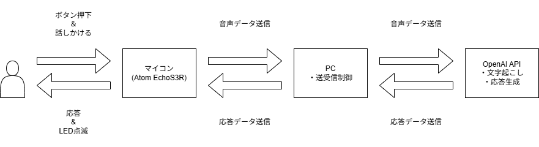

---
html:
  embed_local_images: true
  embed_svg: true
  offline: true
  toc: true
export_on_save:
  html: true
---

# 音声対話ガジェット

## 凡例

本書内での記述例を示す。

:::tip
補足的な小技や、知っていると作業しやすくなる内容を書く。
:::

:::info
前提知識、仕様、背景などの共有情報を書く。
:::

:::source
出典や参照元リンクを書く。
:::

:::note
補足メモ、あとで見返したい気付き、雑多な記録を書く。
:::

:::warning
誤ると大きな影響が出る注意点や、避けるべき操作を書く。
:::

:::caution
扱いに注意が必要な手順や、条件付きで使う内容を書く。
:::

:::sample
コマンド、設定例、コード片などの記述例を書く。
:::

:::result
コマンド実行結果、確認結果、出力例を書く。
:::

## 1. プロジェクト概要

本プロジェクトは、土日の2日間で、AIによるコード生成をフル活用し、音声対話が可能なスタンドアロンガジェットのデモ機を確実に完遂・動作させるための開発プロジェクトである。

開発の迅速性と通信の確実性を最優先し、ネットワークトラブルの要因を排除した「USBシリアル直結方式」を採用する。ただし、将来的なWi-Fi対応を見据え、通信層は差し替え可能な構造とする（§9参照）。

## システム構成・ハードウェア仕様

### 採用ハードウェア

- メインマイコン: [M5Stack Atom EchoS3R (VoiceS3R)](https://docs.m5stack.com/ja/core/Atom_EchoS3R)
  - コア: ESP32-S3-PICO-1-N8R8 (Flash 8MB / PSRAM 8MB)
  - オーディオ: ES8311 (オーディオコーデックIC) + NS4150B (アンプ)
  - 入力: MEMSマイク ×1、天面物理ボタン ×1 (G41)
- 拡張インジケーター: [M5Stack用NeoPixel互換LED搭載 HEXボード](https://docs.m5stack.com/en/unit/hex)
  - LED数: 37灯 (SK6812)
  - 接続: Atom EchoS3R の Groveポート（Port.A）に直結  
  Port.A ピン割当: GND / 5V / G2 / G1
  - データピン: **G2 を第一候補**とする。  
  初回疎通確認で反応しない場合は G1 に切り替える（コード上は定数1箇所で変更可能にする）。
- 中継・処理サーバー: 一般的なノートPC (windows11)
  - マイコンとは USB Type-C ケーブルによる有線シリアル通信で接続。

### 電源・安全対策

- HEXボードの37灯を最大輝度（白）で点灯させると500mA以上の電流を消費し、マイコン側で電圧降下によるリセットが発生するリスクがある。  
- 対策1: マイコン側のファームウェアにて、LEDの最大輝度を30%〜50%以下（例: `strip.setBrightness(80);`）に制限する。  
- 対策2: 全アニメーションは「常に一部のLEDのみ点灯」する演出とし、37灯同時フル点灯（特に白）を行うパターンは作らない。起動時のテスト点灯も低輝度・順次点灯とする。

## 通信プロトコル仕様

今回はUSBシリアルとする

### 物理層

- ESP32-S3のネイティブUSB CDCを使用するため、**ボーレート設定は名目値**であり実効速度に影響しない（実効スループットはUSB依存で十分高速）。コード上は慣例として `115200` を指定しておけばよい。  
- **注意（ポートオープン時リセット）:** PC側でシリアルポートを開いた際、DTR/RTS信号によりマイコンがリセットされる場合がある。これを前提とした接続ハンドシェイクを §3.4 に定める。

### パケット構造（同期マーカー＋ヘッダ＋ボディ方式）

バイナリデータ内に任意のバイト値が含まれるため、同期マーカー付き固定ヘッダ形式でパケットを管理する。

| フィールド | バイトサイズ | 説明 |
| :--- | :--- | :--- |
| 同期マーカー (SYNC) | 2バイト | 固定値 `0xA5 0x5A` |
| コマンドヘッダ (CMD) | 1バイト | 制御命令（§3.3参照） |
| データサイズ (SIZE) | 4バイト | 後続するボディデータのバイト長（ビッグエンディアン） |
| ボディデータ (BODY) | 可変 | 音声バイナリデータ、または制御パラメータ |

受信側の堅牢性ルール（マイコン・PC共通）:

1. 受信パーサは常に `0xA5 0x5A` を探索して読み捨て再同期する（デシンクからの自動復帰）。
2. SIZE上限: 2MB (2,097,152バイト)。 これを超える値を受信した場合は不正パケットとみなし、パーサをリセットして再同期する。
3. ボディ受信タイムアウト: 5秒（無進捗判定）。 BODY待ちの間、**新しいデータが5秒間届かない**場合は当該パケットを破棄し、パーサをリセットして再同期する。
   ※v1.3.2で「ヘッダ受信後5秒以内にBODY全体が揃う」から改訂。旧定義は、大きなBODY（最大約1.44MBの音声）の転送が実効リンク速度次第で5秒を超えると**正常な転送を誤って破棄**してしまうため（task7実機確認で発生）。本タイムアウトの目的は停滞した送信元の検知であり、進捗が続く限り遅い転送は正常として扱う。

### コマンドID定義 (CMD)

| CMD | 送信元 | 送信先 | 意味 | BODY |
| :-- | :-- | :-- | :-- | :-- |
| `0x01` | マイコン | PC | 録音音声データ送信（ボタン長押し終了時） | PCM RAW (24kHz) |
| `0x02` | PC | マイコン | 受理・処理開始（「考え中」LEDアニメーション開始要求） | なし (SIZE=0) |
| `0x03` | PC | マイコン | 音声再生要求 | 先頭1バイト＝エフェクトID、以降 PCM RAW (24kHz) |
| `0x04` | PC | マイコン | エラー通知（マイコンは待機状態へ復帰） | なし (SIZE=0) |
| `0x05` | マイコン | PC | キャンセル通知（ユーザー操作による強制中断。PCは進行中の処理とRealtimeセッションを破棄する。§7.2） | なし (SIZE=0) |
| `0x06` | マイコン | PC | READY（起動完了通知） | なし (SIZE=0) |

エフェクトID（`0x03` BODY先頭1バイト）:

- `0x00`: 通常応答（再生中は青の周期明滅）
- `0x01`: お祝い演出（「ありがとう」への定型返答時。特殊LEDエフェクト）

### 接続ハンドシェイク

1. マイコンは起動完了時に `0x06` (READY) を送信する。
2. PC側はポートオープン後（DTRリセットによりマイコンが再起動する可能性を考慮し）、最大5秒間 READY を待ってからリンク確立とみなす。5秒以内にREADYが来ない場合も、警告ログを出した上で受信待機に入る（既に起動済みでREADYを逃したケースの救済）。
3. READY待機中に受信したユーザー操作は、要求を無制限に蓄積せず、次の規則で処理対象を集約する。
   - `0x01` (RECORDED_AUDIO): 最新の1件だけを保持する。新しい録音を受信した場合は古い録音を置き換える。
   - `0x05` (CANCEL): それ以前に保持していた録音を破棄する。CANCEL後に新しい録音を受信した場合は、その録音を保持する。
   - その他の非READYコマンド: 警告ログを出して破棄する。
   - READY受信時または5秒のタイムアウト時に、保持している録音があれば後段の受信処理へ1件だけ引き継ぐ。

### タイムアウトによる状態復帰（マイコン側）

- `0x01` 送信後、3秒以内に `0x02` が来ない場合: PC未接続・PC側異常とみなし、エラー表示（§5参照）ののち待機状態へ復帰する。
- `0x02` 受信後、35秒以内に `0x03` または `0x04` が来ない場合: 同様にエラー表示ののち待機状態へ復帰する。
- ※各タイムアウト値（3秒/35秒）はコード上で定数化し、実測に応じて調整可能にする。
- ※タイムアウト変更の根拠: 旧構成（Whisper＋GPT-4o-mini＋TTS直列）のPC側実測で
  STT 9.33秒 + LLM 3.59秒 + TTS 1.42秒 = 合計14.34秒となり、旧15秒定数では余裕が0.66秒しかなく、
  シリアル送信時間やAPI応答のばらつきを考慮すると実運用で容易に超過し得るため、v1.2で30秒へ拡大した。
  v1.3でRealtime API（§7.2）へ移行し、PC側の応答待ちを25秒に短縮する。
  マイコン側はAPI処理後のBODY組み立てとシリアル送信の余裕を10秒確保するため35秒とする。
  両者は個別に調整できるようコード上も別々の定数として保持する。

## 音声データフォーマット仕様

録音・再生とも 24kHz に統一する。OpenAI Realtime API（§7.2参照）のPCM入出力が24kHz/16bit/モノラル固定であるため、これに合わせることで、PC側・マイコン側とも変換処理（リサンプリング・ffmpeg等）を完全に排除できる。

| 経路 | フォーマット | サンプリングレート | ビット深度 | チャンネル |
| :--- | :--- | :--- | :--- | :--- |
| 録音（マイコン➔PC） | PCM RAW（ヘッダなし） | 24,000 Hz | 16-bit | モノラル |
| 再生（PC➔マイコン） | PCM RAW（ヘッダなし） | 24,000 Hz | 16-bit | モノラル |

- 録音データはRealtime APIの入力形式（pcm16: 24kHz/16bit/モノラル/リトルエンディアン）へ無変換で転送する。
- 再生系はRealtime APIの音声出力（pcm16: 24kHz/16bit/モノラルRAW）をそのまま無変換で転送する。これによりpydub・ffmpeg等の変換依存を完全に排除する。
- 定型応答音声（「どういたしまして」等）も、同フォーマットで事前生成したPCMファイルをPC側に保持し、`0x03`（エフェクトID `0x01`）で送信する。
- マイコン側I2Sは録音・再生とも24kHz固定でよく、レート切り替えは不要（M5Unifiedの Mic/Speaker クラスを使用する場合も同一レート設定で対応）。
- ※v1.2までは録音16kHz/再生24kHzの非対称構成だったが、採用モデルをgpt-realtime-mini（Realtime API）に確定した際、入力が24kHz固定であることから24kHz統一に変更した（v1.3）。

### 録音の制約

- **最大録音長: 30秒。** 到達した時点で録音を強制終了し、その時点までのデータを `0x01` で送信する（24kHz/16bit/モノラルで約1.44MB。パケットSIZE上限2MBの範囲内。バッファはPSRAMに `heap_caps_malloc(..., MALLOC_CAP_SPIRAM)` で確保する）。
- **最短録音長: 1.5秒。** 未満の場合はデータを破棄して待機状態へ戻る（誤操作・チャタリング対策）。破棄時は黄色の短い点滅でユーザーにフィードバックする。
- ※最短・最長とも定数化し、実測に応じて調整可能にすること。

### 応答音声の制約

- **最大応答長: 30秒。** モデル応答（`0x03` の音声BODY）は最大30秒（24kHz/16bit/モノラルで約1.44MB、パケットSIZE上限2MBの範囲内）とする。
- PC側で担保する: (1) セッションのinstructionsで短い返答を指示し、(2) 応答音声が30秒相当を超えた場合はPC側で生成を停止（`response.cancel`）して30秒までで打ち切って送信する。

## ステータス及びLED表現仕様

LED駆動方式の制約: NeoPixel制御には**RMTペリフェラルを使用するライブラリ**（Adafruit NeoPixel / FastLED のESP32 RMTバックエンド等）を使用すること。RMT駆動は割り込み禁止を伴わないため、音声処理（I2S DMA）とLED更新の同時実行が可能であり、排他制御は不要である。

1. 【待機中】
    - 状態: ユーザーのボタン入力を待っている状態。
    - LED表現: 緑色でゆっくりとホタル点滅（生きてるアピール、うるさくない程度）。
2. 【録音中】
    - 状態: 天面ボタンが「長押し」されている間。マイクからPCMデータをPSRAMバッファに蓄積。
    - LED表現: 赤色点灯（録音中であることを明示）。
3. 【考え中（サーバー処理中）】
    - 状態: `0x02` 受信後、PC側でRealtime APIによる応答生成が動いている間（数秒程度の待ち時間を想定）。
    - LED表現: HEXボードのLEDがぐるぐると円状に回転するアニメーション。ユーザーにフリーズしていないことを視覚的に伝える。
4. 【応答・再生中】
    - 状態: PCから送り返されてきた音声データを、I2S経由でスピーカーから再生している間。
    - LED表現: 青色が一定周期（1000ms程度）で明滅する。音声波形との同期は行わない（実装コスト削減。周期は定数化して調整可能にする）。
5. 【お祝い演出】
    - 状態: エフェクトID `0x01` の音声を再生している間。
    - LED表現: レインボー等の特殊エフェクト（37灯同時フル点灯は避けること。§2.2対策2）。
6. 【エラー】
    - 状態: §3.5のタイムアウト発生時、または `0x04`（エラー通知）受信時。
    - LED表現: 赤色の速い点滅3回 ➔ 待機状態へ復帰。
7. 【録音破棄（短すぎ）・単押し】
    - LED表現: 黄色の短い点滅 ➔ 待機状態へ復帰（§6の単押しフィードバックと共通）。
8. 【キャンセル受理（トリプルクリック）】
    - LED表現: マゼンタの短い点滅2回 ➔ 待機状態へ復帰（§6参照。エラーの赤点滅は行わない）。
      ※v1.3.1で青→マゼンタに変更。再生中（青の明滅）にトリプルクリックした場合、青の点滅では
      受理フィードバックが再生表示と区別できないため（task7実機確認での知見）。黄は録音破棄
      （§5-7）と紛れるため不採用。

## ボタン操作仕様

- デバウンス: ソフトウェア・デバウンス処理必須（30〜50ms程度）。
- 操作の定義（押下時間の境界は1.5秒＝§4.1の最短録音長と同一の定数を共用。
  マルチクリック判定窓は**初回押下から1.2秒の絶対窓**＝押下ごとの窓延長は行わず、
  窓の満了時点でクリック数を確定する。ただしトリプルクリックのみ、窓内に3回目の
  押下を検出した時点で満了を待たず即時確定してよい）:
  - **単押し（1〜2回）**: 1.5秒未満で解放×1〜2回。何もしない（押下時点で開始した録音は破棄し、黄色の短い点滅でフィードバック。§4.1）。
  - **長押し**: 1.5秒以上押して解放。押下で録音開始、解放で録音終了＆送信。
    PC側ではセッションなしなら新規セッション開始（会話の起点）、セッション生存中なら会話の継続として扱われる（§7.2）。
- 待機中以外の単押し・長押しは無視する（考え中・再生中の誤操作による状態破壊を防止）。
- トリプルクリック（強制リセット、全状態で有効）: 初回押下から1.2秒以内に3回押下を検出した場合、現在の状態に関わらず以下を実行する:  
    ※ タイムアウトによりスタックしない想定だが、確実に初期状態へ戻せる物理手段として用意する。
    ※ 待機中に会話（セッション）だけが生きている場合もこの操作で会話を終了できる（会話終了専用の操作は設けない。
    ダブルクリック＝会話終了案を検討したが、待機中のトリプルクリックと効果が完全に同一のため不採用。2026-07-11）。
    1. 再生中であれば即時停止、各バッファをクリア
    2. PCへ `0x05`（キャンセル通知）を送信（PCは進行中のパイプライン処理を破棄する）
    3. 受理フィードバックとしてマゼンタの短い点滅2回を表示し（誤操作でないことを確認できるようにする。
       エラー表示の赤点滅は行わない。色はv1.3.1で青→マゼンタに変更、§5-8参照）、即座に待機状態へ復帰
- 単押しの黄点滅フィードバックは、マルチクリック判定窓の確定後に表示する
  （押下時点では後続のクリックが続くか判らないため）。

## アプリケーション処理フロー

### マイコン側（Arduino / C++）

1. 起動時にI2S（マイク・スピーカー）、GPIO（ボタン G41）、USB CDCシリアル、NeoPixel（G2、RMT駆動）を初期化し、`0x06` (READY) を送信。
2. 天面ボタンの入力を監視（デバウンス＋マルチクリック検出。単押し/トリプルクリックと長押しを§6の定義で判別）。
3. ボタン押下（長押し開始）で録音開始（PSRAMバッファへ蓄積、最大30秒で強制終了）。
4. ボタン解放で録音停止。1.5秒未満なら破棄（黄点滅）、以上なら `0x01` で全音声バイナリをPCへ送信し、`0x02` 待ち（3秒タイムアウト）へ。
5. シリアルからのコマンド受信を待ち受ける（同期マーカー方式パーサ）。  

    - `0x02` 受信 ➔ LEDを「考え中（ぐるぐる）」モードへ移行。`0x03`/`0x04` 待ち（35秒タイムアウト。§3.5）へ。
    - `0x03` 受信 ➔ BODY先頭1バイトのエフェクトIDに応じたLED演出を開始し、後続の音声バイナリ（24kHz）を再生。v1では全BODY受信完了後に再生を開始するが、ファームウェア内部は「受信部がリングバッファへ書き込み、再生タスクがリングバッファから読んでI2S DMAへ流す」構造とし、将来のストリーミング化（受信しながら再生）が受信部の変更のみで済むようにする（§9参照）。
    - `0x04` 受信 ➔ エラー表示ののち待機状態へ復帰。
6. 再生完了後、待機状態へ復帰。

### PC側（Python シリアルスクリプト）

FastAPI等のWebフレームワークは使用せず、単一OSスレッドのシリアルスクリプトとする。ただし処理中のキャンセルを即時受理するため、`asyncio`イベントループ上で非ブロッキングのシリアルポーリングとRealtime WebSocket受信を多重待機する（ワーカースレッドは追加しない）。通信部は Transport クラスとして抽象化する（§9参照）。

音声対話には **OpenAI Realtime API（モデル: `gpt-realtime-mini`）** を使用し、STT・応答生成・TTSを1つのspeech-to-speechセッションに集約する（旧v1.2まではWhisper＋GPT-4o-mini＋TTSの直列3段構成だったが、実測で合計14秒超を要したため置き換えた。v1.3）。

1. COMポート自動検出: `pyserial` の `list_ports` でVID `0x303A`（Espressif）のポートを検索して自動接続する。該当が複数または0件の場合は候補一覧を表示してユーザーに選択させる。接続後、READY待ち（§3.4）。
2. Realtimeセッションは**会話サイクル（最大3往復）と1対1で対応**させる（1セッション＝1サイクル）。
   常駐セッションは採用しない。アイドル中の接続死（NATタイムアウト・PCスリープ等）や60分上限による
   「気付かないうちに履歴が消えている」事態を構造的に排除し、履歴の寿命を接続の寿命と一致させるためである。
    - サイクル開始条件: セッション未接続の状態で `0x01`（録音）を受信したとき、WebSocket接続を確立する
      （接続確立のレイテンシ（数百ms想定）はサイクル先頭の1往復目にのみ発生する）。
    - サイクル終了条件（いずれかで**セッションを破棄**し、次の発話は新しいサイクルとなる）:
      1. 成功した往復が3回完了したとき（会話履歴の一括リセット。項目単位の削除管理は行わない）。
      2. アイドルタイムアウト: **応答再生の終了（推定）から15秒間**次の発話（`0x01`）がないとき、セッションを破棄する。
         再生終了時刻は、PC側が`0x03`送信時に音声長（PCMバイト数÷48,000バイト/秒）から推定して起点を先送りする。
         ※v1.3.3で起点を「最後の応答完了（受信完了）」から改訂。マイコンは再生中のボタン押下を受け付けないため、
         受信完了を起点にすると15秒を超える応答では**再生中に期限が来て**ユーザーが応じる間もなく履歴が消えるため。
         本ルールの意図は「ユーザーが15秒黙ったら別の会話」であり、その測り方を正したもの。
         受信待機ループはポーリング周期ごとに経過時間を確認し、超過を検知した時点で能動的に破棄する
         （単一スレッド構成のままバックグラウンドタイマーなしで実現できる）。時間は定数化し調整可能とする。
         万一破棄漏れの状態で `0x01` を受信した場合も、経過時間を再確認し旧セッションを破棄してから
         新セッションで応答する（フォールバック）。
      3. `0x05` を受信したとき（§6のトリプルクリック＝強制リセット。待機中の会話終了としても
         処理中の中断としても、進行中の応答生成があれば中止し、サイクル全体を破棄する）。
      4. Realtime APIエラーが発生したとき（エラー後のセッション状態の妥当性を推測しない。常に作り直す）。
    - 履歴方式の設計意図: スライディングウィンドウ方式（常に直近3往復を保持）は採用しない。
      「どこまで覚えているか」がユーザーから予測しづらく、忘却の瞬間が会話の途中に紛れ込むことで
      期待との齟齬が生じるため。「3往復で必ず全部忘れる」「15秒黙ったら別の会話」
      「トリプルクリックでいつでも会話を終えて全部リセット」
      という明確なルールにより、期待を裏切る瞬間を作らない。
3. セッション確立時の設定:
    - 入出力とも pcm16（24kHz/16bit/モノラル）。
    - `turn_detection: null`（サーバーVAD無効。ボタン操作による明示的ターン制のため、push-to-talkパターンを使用）。
    - instructionsで「短い話し言葉で返答する」旨を指示（§4.2の最大応答長30秒の一次担保）。
    - ツール（function calling）として「ユーザーが感謝を述べた」ことを通知する関数を定義し、インテント判定を受け取る（旧JSONモード構造化出力の代替）。
4. マイコンから `0x01`（音声）を受信完了したら、即座に `0x02`（考え中要求）を返送。
5. 受信したRAW音声（24kHz）を、各ターンの先頭で `input_audio_buffer.clear` してから `input_audio_buffer.append`（base64）→ `input_audio_buffer.commit` → `response.create` の順でRealtime APIへ投入し、応答音声（pcm16 24kHz）とインテント（ツール呼び出しの有無）を受け取る。VAD無効時に入力バッファを明示的にクリアし、3往復の各ターンで前回の未コミット音声が混入しないようにする。
    - 応答待ちタイムアウト: 25秒（初回と再試行を合わせた共通期限。マイコン側§3.5の35秒より10秒短くし、BODY組み立てとシリアル送信の余裕を確保する。別定数として個別調整可能にする）。
    - 応答音声が30秒相当を超える場合は `response.cancel` で打ち切る（§4.2）。
    - SDKの自動再接続・自動再試行は無効化する。送信失敗・接続断を検知した場合は、
      アプリケーション側の制御でセッションを破棄して1回だけ新セッションで再試行する
      （サイクル途中の接続死への備え。再試行後の失敗はエラー扱い）。
6. インテントに応じて送信内容を決定:
    - 通常応答: 受信した応答音声を `0x03`＋エフェクトID `0x00`＋音声バイナリで送信。
    - 感謝インテント検出時: 事前生成済みの定型音声PCMを `0x03`＋エフェクトID `0x01` で送信。
7. Realtime応答待ち中も、`asyncio`でRealtime WebSocketイベントとシリアル受信を多重待機する。`0x05`（キャンセル）を受信した場合は `response.cancel` を送信し、進行中の応答生成を中止してセッションを破棄し、受信待機に戻る（サイクル終了。履歴には何も残らない）。キャンセル処理を優先し、同時期に到着した未送信の応答結果は破棄する。
8. Realtime API呼び出しでエラーが発生した場合、`0x04`（エラー通知）を送信し、セッションを破棄して受信待機に戻る（サイクル終了）。

APIキーは環境変数 `OPENAI_API_KEY_VIG` から読み込む。

## デバッグ・運用補助

- PC側で受信した録音PCMを、タイムスタンプ付きWAVファイルとしてローカル保存する（マイクゲイン・音質問題の切り分け用）。
- 応答のtranscript（Realtime APIが返す文字起こし）・所要時間・消費トークン数（レスポンスのusage情報から取得できる場合）をコンソールログに出力する。

## 将来拡張（Wi-Fi対応）に向けた設計上の担保

本デモではUSBシリアル直結とするが、以下の構造により将来のWi-Fi移行時の変更範囲を局所化する。

- PC側: パケット送受信を `Transport` クラス（`send_packet(cmd, body)` / `recv_packet()`）として抽象化し、応答生成パイプライン（Realtime API連携）から分離する。Wi-Fi化の際は `SerialTransport` を `TcpTransport`（またはWebSocket）に差し替えるのみとする。パケット構造（SYNC/CMD/SIZE/BODY）はTCP上でもそのまま流用可能。
- マイコン側: §7.1の通り、再生系を「リングバッファ＋再生タスク」構造にしておく。Wi-Fi化で帯域が細くなった場合のストリーミング再生（チャンク分割受信しながら再生）は、受信部がリングバッファへ逐次書き込む形に変えるだけで対応できる。
- v1実装は「全受信後再生」とし、ストリーミング化はスコープ外とする（USB CDCの転送は十分高速であり、体感遅延への寄与が小さいため）。
- ハンズフリー会話継続（長押しで会話を開始した後、ボタン操作なしで発話を続けられる方式）はv1スコープ外とし、v1はpush-to-talk方式（毎発話ごとに長押し）を採用する（2026-07-11確定）。
  - 実現方式の候補として「応答再生完了後の15秒間、マイコン側が簡易VAD（音量しきい値＋無音終了検出＋プリバッファ）で音声を自動待ち受けし、検出時に通常の `0x01` を送る」方式を検討済み。この方式は**プロトコル・PC側実装の変更が一切不要**（PCからはボタン起点の録音と区別がつかない）で、ファームウェア側の追加のみで後付け可能。
  - v1で見送った理由: VADのしきい値調整が環境依存で、誤検出（勝手に録音・雑音への応答）や不検出の予測不能性が「期待を裏切らない」という本プロジェクトの設計原則と相性が悪く、§1の「確実に完遂」を優先したため。

## 変更履歴

- v1.3.3: アイドルタイムアウト（§7.2-2）の起点を「最後の応答完了（受信完了）」から
  「応答再生の終了（推定）」へ改訂。task8の実機E2Eで、15秒を超える応答の再生中に
  セッションが破棄され、続きの発話が新しい会話になってしまう問題が判明したため
  （2026-07-14）。PC側実装のみの変更（`0x03`送信時に再生時間ぶん起点を先送り）。
- v1.3.2: ボディ受信タイムアウト（§3.2ルール3）を「ヘッダ受信後5秒以内にBODY全体」から
  「BODY待ち中に新しいデータが5秒間届かない場合」（無進捗判定）へ改訂。task7の実機確認で、
  マイコン→PCの最大録音（30秒≈1.44MB）送信が5秒を超え、PC側パーサが受信途中の正常な
  パケットを破棄する不具合が発生したため（2026-07-12）。マイコン側・PC側の両実装を更新。
- v1.3.1: キャンセル受理（トリプルクリック）のLED点滅色を青→マゼンタに変更（§5-8, §6）。
  task7の実機確認で、再生中（青の明滅）のトリプルクリック時に受理フィードバックが
  再生表示と区別できないことが判明したため（2026-07-12）。
- v1.3: 採用モデルを `gpt-realtime-mini`（Realtime API、speech-to-speech）に確定し、
  STT/LLM/TTSの直列3段構成を廃止（§7.2）。録音サンプリングレートを16kHz→24kHzに変更し
  録音・再生とも24kHz統一（§4、Realtime APIのpcm16入力が24kHz固定のため）。
  最大応答長30秒を新設（§4.2）。インテント判定をJSONモードからfunction callingに変更。
  会話履歴は「1セッション＝1サイクル」方式とし、成功3往復完了・アイドル15秒・
  キャンセル・APIエラーのいずれかでセッションごと破棄する（常駐セッションおよび
  スライディングウィンドウは予測可能性の観点で不採用）。
  APIキー環境変数名を `OPENAI_API_KEY_VIG` と規定。
  ボタン操作の単押し（1.5秒未満・何もしない）／長押し（1.5秒以上・録音）の境界を
  §4.1の最短録音長と同一定数として明文化。マルチクリック判定窓を「初回押下から
  1.2秒の絶対窓（押下ごとの窓延長なし）」と規定（§6）。待機中の会話終了はトリプルクリックで行う
  （ダブルクリック新設案は待機中トリプルクリックと効果が同一のため不採用）。
  トリプルクリックに受理フィードバック（青短点滅2回）を追加し、
  エラーLED（§5-6）の発動条件から「キャンセル操作時」を除外して
  §3.5のタイムアウト時または`0x04`受信時に限定（§5, §6）。
  PC側応答待ちを25秒、マイコン側タイムアウトを35秒とし、送信余裕を確保。
  単一OSスレッドの`asyncio`多重待機による処理中キャンセルと、VAD無効時の
  `input_audio_buffer.clear`を明記。SDK自動再試行は無効化し、アプリ側で1回だけ再試行する。
- v1.2: `0x02`受信後のタイムアウトを15秒→30秒に変更（§3.5）。PC側実測
  （STT 9.33秒＋LLM 3.59秒＋TTS 1.42秒＝合計14.34秒）に基づく。
- v1.1: 同期マーカー・SIZE上限・受信タイムアウト追加（§3.2）／エラー・キャンセル・READYコマンド追加とハンドシェイク定義（§3.3〜3.5）／`0x04`規定アクションを`0x03`＋エフェクトIDに統合／録音16kHz・再生24kHzの非対称構成に変更しffmpeg依存を排除（§4）／録音の最長30秒・最短1.5秒を規定（§4.1）／LED排他制御要件を削除しRMT駆動を必須化（§5）／再生中LEDを一定周期明滅に簡略化／ボタン操作仕様を新設しトリプルクリック強制リセットを追加（§6）／PC側をFastAPIから単一シリアルスクリプトに変更、Transport抽象化を明記（§7.2, §9）／COMポート自動検出・会話履歴3往復・JSON構造化出力を規定／Groveピン割当（G1/G2）を明記
- v1.0: 初版
