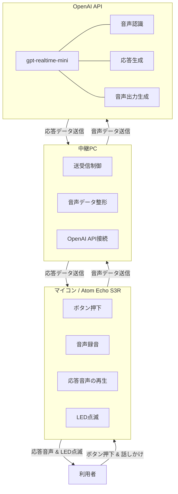
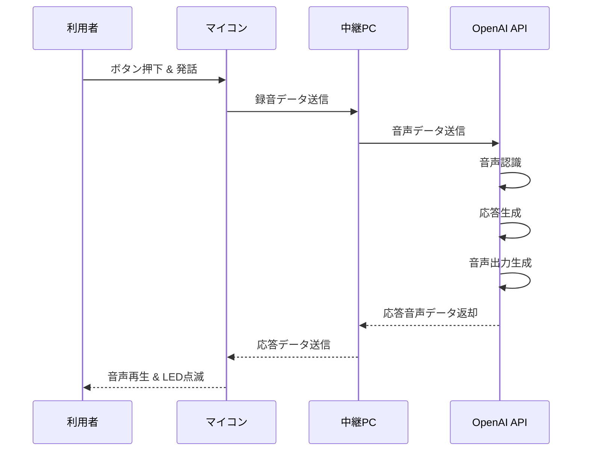

---
html:
  embed_local_images: true
  embed_svg: true
  offline: true
  toc: true
export_on_save:
  html: true
---

# OpenAI Realtime系モデル選定メモ

> **追記（2026-07-14）**: 実装完了後、不採用とした `gpt-realtime-2.1-mini`（Reasoning）を
> 実測比較できるよう、両エントリポイントに `--model` 引数を追加した。
> 比較手順は `docs/how_to_compare_models.md` を参照。

## 目的

最大30秒の音声入力を最大3往復やり取りする小型ガジェット向けに、OpenAI APIで利用するモデルを選定する。

想定構成は次のとおり。

- マイコン: Atom Echo S3R
  - ボタン入力
  - 録音
  - 応答音声の再生
  - LED点滅
- PC: 安価な中継用PC
  - OpenAI APIとの接続
  - 音声データの送受信制御
- OpenAI API
  - 音声認識
  - 応答生成
  - 音声出力

本来はマイコン直結が理想だが、今回は時間的制約から PC中継あり の前提とする。

## 前提条件

### 必須条件

- 音声入力・音声出力に対応していること
- 最大30秒の入力を扱えること
- 最大3往復程度の短い会話で使えること
- 応答開始までの遅延が小さいこと
- 試作しやすいこと

### 重視する観点

1. 体感速度
2. 実装の簡単さ
3. コスト
4. 応答品質

### 今回あまり重視しないもの

- 複雑な推論能力
- 長大コンテキストの活用
- 高度なツール連携

## 候補モデル

検討対象にした主な候補は次のとおり。

1. [`gpt-realtime-mini`](https://developers.openai.com/api/docs/models/gpt-realtime-mini)
2. [`gpt-realtime-2.1-mini`](https://developers.openai.com/api/docs/models/gpt-realtime-2.1-mini)
3. [`gpt-audio-mini`](https://developers.openai.com/api/docs/models/gpt-audio-mini)（※ Deprecated のため除外）
4. STT + テキストモデル + TTS の分離構成

## 候補比較

| 候補 | 採否 | 主な理由 |
| --- | --- | --- |
| `gpt-realtime-mini` | 採用 | Non-Reasoning。Realtime音声入出力に対応。遅延を抑えやすい |
| `gpt-realtime-2.1-mini` | 不採用 | Reasoningモデル。速さ評価は高いが、推論遅延を避けたい今回の方針に合わない |
| `gpt-audio-mini` | 不採用 | Deprecated |
| 分離構成（STT + LLM + TTS） | 不採用 | API呼び出し段数が増え、試作工数・遅延・構成複雑さが増える |

---

## `gpt-realtime-2.1-mini` を外した理由

`gpt-realtime-2.1-mini` は魅力のあるモデルだが、今回は見送った。

### 外した理由

- Reasoningモデルである
- 推論処理により、応答開始までの遅延が増える可能性がある
- 今回の用途では、複雑な推論よりも 短い待ち時間 の方が重要
- 3往復程度の会話では、高い推論能力の恩恵が限定的

### 補足

`gpt-realtime-mini` と `gpt-realtime-2.1-mini` は、いずれも速度評価としては高速クラスだが、
今回の判断基準は 「Reasoningを避ける」 ことを優先した。

## `gpt-audio-mini` を外した理由

一時候補として考えたが、Deprecated のため除外した。

Deprecated モデルは将来的な継続利用や保守の観点で不利であり、新規採用には向かない。

## 分離構成を外した理由

分離構成の例:

- 音声認識: STTモデル
- 応答生成: テキストモデル
- 音声出力: TTSモデル

### メリット

- 個別最適化しやすい
- コスト調整の自由度がある

### デメリット

- API呼び出しが増える
- 実装箇所が増える
- 音声→テキスト→応答→音声の段数が増え、遅延が伸びやすい
- 試作期間が短い今回には不向き

今回の目標は 短期間で動くデモを作ること なので、構成の単純さを優先した。

## 最終選定

### 採用モデル

`gpt-realtime-mini`

### 選定理由

- Non-Reasoning である
- Realtime API で音声入力・音声出力を一体で扱える
- 応答開始までの待ち時間を抑えやすい
- PC中継構成との相性がよい
- STT/LLM/TTSを分割するより試作しやすい

### この選定が向いている条件

- 最大30秒の発話
- 最大3往復程度
- 複雑な推論は不要
- 速度重視
- まずはデモが動くことを優先

## 推奨構成図

役割が分かるよう少し詳細化した構成図を以下に示す。

### 構成の意図

- マイコンは入出力に専念する
- PCは中継と接続制御を担当する
- OpenAI API側で、音声認識・応答生成・音声生成をまとめて処理する

この分担により、マイコン側の実装負荷を下げつつ、短期間で試作しやすい構成になる。

## 1往復の処理イメージ

## コスト試算（暫定）

[`gpt-realtime-mini` のモデルページ](https://developers.openai.com/api/docs/models/gpt-realtime-mini)では、
テキスト単価は確認できる一方で音声単価は明示されていない。そのため、
[`gpt-realtime-2.1-mini` の音声単価](https://developers.openai.com/api/docs/models/gpt-realtime-2.1-mini)を
同等と仮定した暫定試算とする。最新価格は[公式価格ページ](https://developers.openai.com/api/docs/pricing)も参照すること。

### 試算前提

- ユーザー発話: 30秒 × 3回
- AI応答: 10〜30秒 × 3回
- 音声入力: $10 / 100万 Audio tokens
- 音声出力: $20 / 100万 Audio tokens
- ユーザー音声: 100ms = 1 Audio token
- AI音声: 50ms = 1 Audio token
- 履歴再入力を含む保守的試算

### 概算結果

| AI応答時間 | 1セッション概算 |
| ---: | ---: |
| 10秒 × 3回 | 約 $0.036 |
| 15秒 × 3回 | 約 $0.045 |
| 20秒 × 3回 | 約 $0.054 |
| 30秒 × 3回 | 約 $0.072 |

目安として、1ドル=150円換算なら 1セッション約5.4〜10.8円 程度。

### 注意

- 実際の請求は公式価格と使用量で確認すること
- セッションの使い方やキャッシュ適用で増減する可能性がある
- 最終的には API 返却の `usage` を記録して実測するのが確実

## 実装上の方針

### まずは以下方針をとる

- 押して話す方式
- 最大30秒で録音停止
- 3往復で会話終了
- 会話終了時にセッションを閉じる（実装では15秒アイドル・キャンセル・APIエラー時も終了）

### 後で改善しやすい要素

- VAD導入
- 割り込み発話
- セッション継続時間の最適化
- 発話途中再生
- 応答速度の計測と改善

## 実機で確認すべき項目

最低限、以下を確認する。

1. 発話終了から応答再生開始までの時間
2. 30秒入力時の安定性
3. 3往復目でも遅延や品質が大きく悪化しないか
4. PCとマイコン間の送受信が安定するか
5. LED点滅などUI連携が自然か

## 結論

今回の用途では、`gpt-realtime-mini` を採用する。

理由は次のとおり。

- Reasoning遅延を避けたい
- 音声入出力を一体で扱いたい
- STT/LLM/TTS分離構成より試作しやすい
- 最大30秒 × 最大3往復の用途に適している
