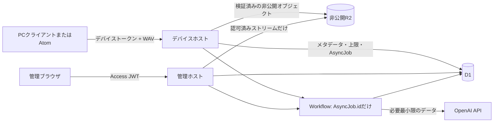

# Phase 1 実装契約

製品の振る舞いは `SPEC.md` を正とする。本書は、その振る舞いを実装する際に必要な保存形式、経路、テスト水準の表現を具体化する。`SPEC.md` の要件を弱めてはならず、矛盾した場合は先に `SPEC.md` を更新する。

## 脅威モデルとデータフロー

| 資産・境界 | 脅威 | 必須の対策 |
| --- | --- | --- |
| PC / AtomからデバイスAPI | トークン窃取、再送、大きすぎる音声 | TLS、一定時間比較のHMACトークン、`household_id`と`source_id`への束縛、R2書込み前のWAV検証、`client_capture_id`冪等性 |
| デバイスAPI | デバイスが管理データへ到達 | ホスト/経路の許可表を分離。デバイス権限は作成、アップロード、解析開始、自身の状態取得だけ |
| 管理ホスト | 偽造または失効したAccessアサーション | JWKSによるAccess JWT署名、`iss`、アプリケーション`aud`、`exp`の検証。世帯はサーバー側で導出 |
| WorkerからD1/R2/OpenAI | 他世帯読取、オブジェクトキー/鍵素材の漏えい | 全クエリの認可条件、認可済みストリームだけの非公開R2、Worker bindingだけの秘密情報、内容/鍵/トークンを含まないログ |
| Workflow永続状態 | 音声、文字起こし、メモ、トークンの保持 | `AsyncJob.id`だけを開始・永続化し、認可後にD1/R2から一時的に読む |
| 同時要求/再試行 | 二重課金、二重発話、古い画面による上書き | D1ユニーク制約、`version`比較更新、操作ごとに1つの有効ジョブ、原子的な上限予約 |
| AI/モデル出力 | プロンプト注入、安全でない出力保存 | 全顧客テキストをタグ付きデータとし、スキーマ検証済み許可値だけを使用し、出力時にHTMLエスケープ |
| デモ運用 | 審査後の無制限利用/書込み | D1の日次/生涯上限、固定再試行上限、`DEMO_WRITE_ENABLED`、全書込み/AI予約前の期限確認 |



クライアントに公開する状態は、`SPEC.md` の「処理フロー」「API案」にある状態表とMermaid図を正とする。以下の各エンドポイントは現在のリソース状態を返すため、ディスパッチ結果が不明でも、盲目的な再送ではなくポーリングで収束できる。

## D1のリレーショナル契約

時刻はUTCのISO 8601文字列で保存する。IDはサーバー発行の不透明な文字列とし、氏名、文字起こし、メールアドレス、R2キーを含めない。各D1接続ではトランザクション前にSQLiteの外部キーを有効化する。

```sql
CREATE TABLE households (
  id TEXT PRIMARY KEY,
  created_at TEXT NOT NULL
);
CREATE TABLE management_principals (
  access_subject TEXT NOT NULL, household_id TEXT NOT NULL REFERENCES households(id),
  created_at TEXT NOT NULL, revoked_at TEXT, PRIMARY KEY (access_subject, household_id)
);
CREATE TABLE sources (
  id TEXT PRIMARY KEY,
  household_id TEXT NOT NULL REFERENCES households(id),
  source_type TEXT NOT NULL CHECK (source_type IN ('pc','atom','sample')),
  created_at TEXT NOT NULL,
  UNIQUE (household_id, id)
);
CREATE TABLE device_tokens (
  id TEXT PRIMARY KEY,
  household_id TEXT NOT NULL REFERENCES households(id), source_id TEXT NOT NULL,
  token_hmac TEXT NOT NULL UNIQUE,
  expires_at TEXT NOT NULL,
  revoked_at TEXT,
  last_used_at TEXT,
  created_at TEXT NOT NULL,
  CHECK (length(token_hmac) = 64),
  FOREIGN KEY (household_id, source_id) REFERENCES sources(household_id, id)
);
CREATE TABLE recordings (
  id TEXT PRIMARY KEY,
  household_id TEXT NOT NULL REFERENCES households(id),
  source_id TEXT NOT NULL,
  client_capture_id TEXT NOT NULL,
  captured_at TEXT NOT NULL,
  captured_at_original TEXT NOT NULL,
  captured_at_source TEXT NOT NULL CHECK (captured_at_source IN ('client_clock','device_clock','server_received','manual')),
  captured_timezone TEXT NOT NULL,
  received_at TEXT NOT NULL,
  pre_roll_seconds INTEGER NOT NULL CHECK (pre_roll_seconds BETWEEN 0 AND 10),
  post_roll_seconds INTEGER NOT NULL CHECK (post_roll_seconds BETWEEN 0 AND 5),
  post_roll_truncated INTEGER NOT NULL CHECK (post_roll_truncated IN (0,1)),
  duration_seconds REAL NOT NULL CHECK (duration_seconds > 0 AND duration_seconds <= 20),
  audio_object_key TEXT, audio_sha256 TEXT CHECK (audio_sha256 IS NULL OR length(audio_sha256) = 64),
  upload_status TEXT NOT NULL CHECK (upload_status IN ('reserved','ready','failed')),
  analysis_status TEXT NOT NULL CHECK (analysis_status IN ('pending','transcribing','extracting_words','ready','partial','failed')),
  review_status TEXT NOT NULL CHECK (review_status IN ('pending','approved','deleting','delete_failed','deleted')),
  diary_status TEXT NOT NULL CHECK (diary_status IN ('not_started','generating','ready','failed')),
  image_status TEXT NOT NULL CHECK (image_status IN ('not_requested','generating','ready','failed','limit_reached')),
  active_attempt_id TEXT,
  version INTEGER NOT NULL DEFAULT 1 CHECK (version > 0),
  created_at TEXT NOT NULL,
  updated_at TEXT NOT NULL,
  retention_delete_after TEXT,
  deleted_at TEXT,
  UNIQUE (household_id, source_id, client_capture_id), UNIQUE (household_id, id),
  FOREIGN KEY (household_id, source_id) REFERENCES sources(household_id, id)
);
CREATE INDEX recordings_household_visible ON recordings(household_id, review_status, captured_at);
CREATE TABLE transcripts (
  recording_id TEXT PRIMARY KEY REFERENCES recordings(id),
  raw_text TEXT, reviewed_text TEXT, language TEXT, model TEXT, prompt_version TEXT,
  created_at TEXT NOT NULL, updated_at TEXT NOT NULL
);
CREATE TABLE word_candidates (
  id TEXT PRIMARY KEY, recording_id TEXT NOT NULL REFERENCES recordings(id),
  surface TEXT NOT NULL, normalized TEXT NOT NULL, part_of_speech TEXT,
  is_new_candidate INTEGER NOT NULL CHECK (is_new_candidate IN (0,1)),
  UNIQUE (recording_id, normalized)
);
CREATE TABLE dictionary_words (
  id TEXT PRIMARY KEY, household_id TEXT NOT NULL REFERENCES households(id),
  normalized TEXT NOT NULL, display_name TEXT NOT NULL,
  first_recording_id TEXT, first_spoken_at TEXT,
  occurrence_count INTEGER NOT NULL DEFAULT 0 CHECK (occurrence_count >= 0),
  UNIQUE (household_id, normalized), UNIQUE (household_id, id),
  FOREIGN KEY (household_id, first_recording_id) REFERENCES recordings(household_id, id)
);
CREATE TABLE word_occurrences (
  id TEXT PRIMARY KEY, household_id TEXT NOT NULL REFERENCES households(id),
  recording_id TEXT NOT NULL REFERENCES recordings(id),
  dictionary_word_id TEXT NOT NULL REFERENCES dictionary_words(id),
  surface TEXT NOT NULL, spoken_at TEXT NOT NULL,
  new_override TEXT NOT NULL CHECK (new_override IN ('auto','force_new','force_not_new')),
  is_first INTEGER NOT NULL CHECK (is_first IN (0,1)),
  created_at TEXT NOT NULL, updated_at TEXT NOT NULL,
  UNIQUE (recording_id, dictionary_word_id),
  FOREIGN KEY (household_id, recording_id) REFERENCES recordings(household_id, id),
  FOREIGN KEY (household_id, dictionary_word_id) REFERENCES dictionary_words(household_id, id)
);
CREATE TABLE diary_entries (
  id TEXT PRIMARY KEY, recording_id TEXT NOT NULL UNIQUE REFERENCES recordings(id),
  scene TEXT, parent_note TEXT, diary_text TEXT, model TEXT, prompt_version TEXT,
  version INTEGER NOT NULL DEFAULT 1 CHECK (version > 0), created_at TEXT NOT NULL, updated_at TEXT NOT NULL
);
CREATE TABLE diary_images (
  id TEXT PRIMARY KEY, diary_entry_id TEXT NOT NULL REFERENCES diary_entries(id),
  image_object_key TEXT NOT NULL, generation_number INTEGER NOT NULL CHECK (generation_number BETWEEN 1 AND 5),
  is_active INTEGER NOT NULL CHECK (is_active IN (0,1)), model TEXT, prompt_version TEXT,
  created_at TEXT NOT NULL, deleted_at TEXT,
  UNIQUE (diary_entry_id, generation_number)
);
CREATE UNIQUE INDEX one_active_image ON diary_images(diary_entry_id) WHERE is_active = 1 AND deleted_at IS NULL;
CREATE TABLE async_jobs (
  id TEXT PRIMARY KEY, household_id TEXT NOT NULL REFERENCES households(id),
  recording_id TEXT NOT NULL,
  job_type TEXT NOT NULL CHECK (job_type IN ('analysis','diary','image','delete')),
  status TEXT NOT NULL CHECK (status IN ('dispatch_pending','dispatched','running','succeeded','failed')),
  workflow_instance_id TEXT, operation_number INTEGER NOT NULL CHECK (operation_number > 0),
  correlation_id TEXT NOT NULL, last_error_code TEXT, created_at TEXT NOT NULL,
  updated_at TEXT NOT NULL, started_at TEXT, finished_at TEXT,
  UNIQUE (recording_id, job_type, operation_number), UNIQUE (household_id, id),
  FOREIGN KEY (household_id, recording_id) REFERENCES recordings(household_id, id)
);
CREATE TABLE processing_attempts (
  id TEXT PRIMARY KEY, household_id TEXT NOT NULL REFERENCES households(id), recording_id TEXT NOT NULL,
  job_id TEXT NOT NULL,
  processing_kind TEXT NOT NULL CHECK (processing_kind IN ('analysis','diary','image','delete')),
  stage TEXT NOT NULL, attempt_number INTEGER NOT NULL CHECK ((processing_kind = 'image' AND attempt_number BETWEEN 1 AND 5) OR (processing_kind <> 'image' AND attempt_number BETWEEN 1 AND 3)),
  status TEXT NOT NULL CHECK (status IN ('running','succeeded','failed','unknown')),
  provider_request_id TEXT, error_code TEXT, retryable INTEGER NOT NULL CHECK (retryable IN (0,1)),
  correlation_id TEXT NOT NULL, started_at TEXT NOT NULL, finished_at TEXT,
  UNIQUE (job_id, attempt_number), UNIQUE (recording_id, processing_kind, attempt_number),
  FOREIGN KEY (household_id, recording_id) REFERENCES recordings(household_id, id),
  FOREIGN KEY (household_id, job_id) REFERENCES async_jobs(household_id, id)
);
CREATE UNIQUE INDEX one_nonterminal_job ON async_jobs(recording_id, job_type)
  WHERE status IN ('dispatch_pending','dispatched','running');
CREATE TABLE usage_counters (
  counter_key TEXT NOT NULL, household_id TEXT REFERENCES households(id), scope TEXT NOT NULL,
  usage_day TEXT NOT NULL, used_count INTEGER NOT NULL DEFAULT 0 CHECK (used_count >= 0),
  reserved_count INTEGER NOT NULL DEFAULT 0 CHECK (reserved_count >= 0),
  updated_at TEXT NOT NULL, PRIMARY KEY (counter_key, usage_day),
  CHECK ((scope = 'image_lifetime' AND usage_day = 'lifetime') OR (scope <> 'image_lifetime' AND usage_day GLOB '????-??-??'))
);
CREATE TABLE audit_events (
  id TEXT PRIMARY KEY, household_id TEXT NOT NULL REFERENCES households(id),
  recording_id TEXT, event_type TEXT NOT NULL,
  actor_type TEXT NOT NULL CHECK (actor_type IN ('management_user','device','system')),
  actor_id TEXT NOT NULL, before_captured_at TEXT, after_captured_at TEXT,
  correlation_id TEXT NOT NULL, created_at TEXT NOT NULL,
  FOREIGN KEY (household_id, recording_id) REFERENCES recordings(household_id, id)
);
CREATE TABLE recording_tombstones (
  recording_id TEXT PRIMARY KEY, household_id TEXT NOT NULL REFERENCES households(id),
  review_status TEXT NOT NULL CHECK (review_status = 'deleted'), deleted_at TEXT NOT NULL
);
```

`counter_key`は、デモ環境全体の上限では`demo-global:{scope}`、世帯上限では`household:{household_id}:{scope}`、画像の生涯5回上限では`recording:{recording_id}:image`とする。予約カウントの加算は、同一トランザクション内で該当上限以下である場合だけ許可する。D1マイグレーションでは状態・期限用の必要なインデックスも作成する。試行、ジョブ、監査イベント、ログへ内容を含む`details`列を追加してはならない。

## 原子的トランザクション境界

| 操作 | 1つのD1トランザクションに含める内容 |
| --- | --- |
| アップロード作成/重複排除 | 先にD1で一意の取得キーと決定的・不透明なR2キーを予約し、同じSHA-256のバイト列だけを書き込む。原子的に`upload_status = ready`にするか、失敗を記録して有限回の孤児後始末へ積む |
| 解析/日記/画像のディスパッチ | 楽観バージョン/有効ジョブ、期限、`DEMO_WRITE_ENABLED`、上限/試行予約、ジョブ作成または既存返却、リソース状態更新 |
| OpenAI呼出し直前 | 期限/キルスイッチ/有効試行を再確認し、`ProcessingAttempt`をちょうど1件作成または更新し、利用量を予約する。トランザクション失敗時はOpenAIを呼ばない |
| 確認保存/承認 | `UPDATE ... WHERE id=? AND household_id=? AND version=?`、文字起こし/発話/辞典集計の再計算、監査イベント、バージョン加算をまとめる |
| 画像置換 | バージョン確認、上限/ジョブ予約、R2成功後にだけ新画像を有効化し旧画像を無効化 |
| 削除 | 直ちに非表示化し有効試行を無効化。削除Workflowは内容を持つ子行と`Recording`を削除し、`recording_tombstones(recording_id, household_id, review_status, deleted_at)`だけを挿入 |

`DictionaryWord`の初出項目と各`WordOccurrence.is_first`は、承認または日時編集のトランザクションで`(spoken_at, recordings.created_at, recording_id)`により再計算する。クライアントが送る`is_first`、上限、状態、世帯、R2キーは信用しない。

## オブジェクト保存と保持

非公開R2キーは不透明IDだけで構成する:

```text
recordings/{recording_id}/audio.wav
diary-images/{diary_entry_id}/{diary_image_id}.png
```

R2には公開バインディング、公開バケットURL、クライアント発行の署名URLを設けない。Workerはストリームごとに認可し、これらのキーを開示しない。新しい画像は有効化前に保存する。削除済み・旧オブジェクトは有限回の削除ジョブへ積み、アクセス不能なものを再有効化しない。

有効な記録にはサーバーが`retention_delete_after = created_at + 30 days`を設定する。スケジュールWorkerはインデックス付き時刻で期限到来記録を探し、同じ有限削除ジョブを開始する。削除失敗の再試行は最大3回であり、期限到来記録を手動操作待ちの「削除可能」な状態で放置しない。クライアントスプールは最大20クリップ、25 MiB、7日とし、R2記録IDの確認後にWAVを削除し、`202 Accepted`確認までは最小処理メタデータだけを保持する。運用ログは状態、所要時間、相関ID、エラーコードだけを7日保持する。

## ホスト・認可・ジョブ契約

| ホスト | 許可する経路群 | 必要な本人確認 |
| --- | --- | --- |
| 管理ホスト | 確認、日記、辞典、認可済み音声/画像、管理用記録API | 検証済みAccess JWT。世帯はサーバー側で導出 |
| デバイスホスト | アップロード、自身の記録の解析開始、自身の状態取得 | 対象ソースへ束縛された、有効期限内のデバイストークン |

ホスト、HTTPメソッド、パス、Content-Typeの組合せが許可表にない要求は、アプリケーション処理前に失敗させる。両ホストはCORSを既定拒否する。管理ホストはデバイストークンを、デバイスホストは管理用JWTをデバイス操作に使う要求を拒否する。範囲外IDには、存在確認につながらない同一形状の未検出/未認可応答を返す。

受理する非同期操作ごとに、安定した不透明IDの`AsyncJob.id`を作る。WorkflowインスタンスIDはそのジョブID（または決定的で機密でない派生値）とし、入力は`{ "async_job_id": "job_xxx" }`だけ、永続状態は不透明IDと状態だけに限定する。`dispatch_pending`は同じIDで「作成または既存確認」を試みて復旧する。正はWorkflow履歴ではなくWorkers/D1である。各`step.do()`には`SPEC.md`の有限再試行上限を明示し、SDK再試行は`maxRetries: 0`で無効化する。送信後タイムアウトは`UPSTREAM_RESULT_UNKNOWN`として予約を消費し、手動再試行前にポーリングを要求する。

Workerは、検証済みAccess JWTの`sub`を、サーバー側の許可済み`management_principals(sub, household_id)`行へ対応付ける。メールアドレスは表示・Accessポリシー用であり、認可キーではない。デバイスの`GET /recordings/{id}`は`recording_id`、`analysis_status`、`review_status`、`version`、安全なエラー項目、呼出元自身の`AsyncJob`概要だけを返す。文字起こし、単語候補、日記、R2項目、試行、管理メタデータは返さない。

| 経路群 | 状態の前提 | 成功時の効果 |
| --- | --- | --- |
| `POST /recordings` | 所有する有効ソースと有効WAV | `Recording.analysis_status = pending`、確認状態`pending` |
| `POST /recordings/{id}/process` | 所有者、削除中/削除済みでない、解析再試行枠あり | 解析ジョブを作成/返却して`202`。Workerが`pending → transcribing → extracting_words → ready/partial/failed`へ遷移 |
| `PATCH /recordings/{id}/review` | 管理本人確認と一致する記録バージョン | 下書きと任意の日時監査を保存し、バージョン加算 |
| `POST /recordings/{id}/approve` | 管理本人確認、一致するバージョン、解析が`ready`/`partial`/`failed` | 承認と`WordOccurrence`を原子的更新し、日記ジョブを作成/返却して`202` |
| `POST /diary/{id}/regenerate` | 管理本人確認、一致する日記バージョン、再試行枠あり | 日記ジョブを作成/返却し、`diary_status = generating` |
| `POST /diary/{id}/image` | 管理本人確認、一致する日記バージョン、必要時の置換確認 | 画像ジョブを作成/返却し、有効画像を消さずに`image_status = generating` |
| `DELETE /recordings/{id}` | 管理本人確認と一致するバージョン | 即時非表示化・試行無効化、削除ジョブ作成/返却、`202` |

## OpenAIへ送るデータの境界

解析Workflowだけが対象WAVを`/v1/audio/transcriptions`へ送る。単語抽出Workflowは結果の文字起こしをタグ付きデータとして、日記Workflowは承認済み文字起こし・場面・親メモをタグ付きデータとして、画像Workflowは承認済み日記文と固定スタイル指示だけを送る。他世帯の履歴、トークン、R2キー、内部エラー、監査詳細は送らない。Responses API要求には`store: false`を付け、OpenAI background modeは使わず、SDKの`maxRetries`は0にする。Phase 7の公開物には、送信データ、既定の学習非利用、不正利用監視での保持可能性、`store: false`の限定的な意味、実在児童データを使わないことを`SPEC.md`どおり開示する。

## HTTP契約とエラー形式

機械可読な正本は [openapi.json](../packages/shared/api/openapi.json) である。Phase 1の全経路、認証方式、要求本文、共通エラー、状態列挙を定義する。OpenAPIだけでは認可条件やトランザクション境界を表せないため、本書と`SPEC.md`の人間向け規則も必須である。

全JSON API成功応答には`correlation_id`を含める。更新操作はJSONのContent-Type、上限付き本文、既存リソース更新時の`version`を必須とする。multipartのWAVアップロードだけは明示的な例外であり、ファイル以外の項目は共有OpenAPI契約で検証する。時刻は2000〜2099年のRFC 3339 UTC値、`captured_timezone`はIANAタイムゾーンとする。

```json
{
  "code": "VERSION_CONFLICT",
  "message": "This item changed. Reload it and try again.",
  "retryable": false,
  "correlation_id": "corr_xxx",
  "next_action": "reload"
}
```

エラーの`message`にはユーザー入力、トークン、SQL、スタックトレース、R2キー、プロバイダー応答を含めない。必須コードには`UNAUTHORIZED`、`FORBIDDEN`、`NOT_FOUND`、`VALIDATION_ERROR`、`VERSION_CONFLICT`、`IDEMPOTENCY_CONFLICT`、`COST_LIMIT_REACHED`、`DEMO_WRITE_DISABLED`、`UPSTREAM_RESULT_UNKNOWN`、`IMAGE_REPLACEMENT_CONFIRMATION_REQUIRED`がある。

```json
// POST /api/v1/recordings（デバイスホスト）: multipart項目とWAV
{
  "client_capture_id": "019f0000-0000-7000-8000-000000000000",
  "captured_at": "2026-07-20T01:00:00Z",
  "captured_timezone": "Asia/Tokyo",
  "pre_roll_seconds": 10,
  "post_roll_seconds": 5,
  "post_roll_truncated": false
}
// 201/200: 重複排除済みの応答
{ "recording_id": "rec_xxx", "analysis_status": "pending", "review_status": "pending", "version": 1, "deduplicated": false, "correlation_id": "corr_xxx" }
```

```json
// POST /api/v1/recordings/rec_xxx/process、POST /approve、日記/画像生成
// 202応答
{ "async_job_id": "job_xxx", "status": "dispatched", "correlation_id": "corr_xxx" }
```

`POST /approve`は`SPEC.md`の項目と空文字/空単語の意味論を受け入れる。有効画像がある`POST /diary/{id}/image`は`{ "version": 5, "replace_image_id": "image_xxx" }`を必須とする。置換確認がなければ、上限を消費せずジョブも作らずに指定の409エラーを返す。

## 契約テスト表

エンドポイント実装前に、以下を共有JSON Schema/OpenAPIに対する決定的な契約テストへ変換する。OpenAIはモック化し、実APIを呼ばない。

| ケース | 期待する不変条件 |
| --- | --- |
| 同じ`client_capture_id`の再送 | 同じ記録ID。R2再書込み、上限/ジョブ消費をしない |
| 誤ったホスト/トークン/JWT/世帯 | 同一形状の拒否。データ、オブジェクトキー、存在有無を漏らさない |
| 不正WAV、大きすぎる本文、不正時刻/列挙値 | `VALIDATION_ERROR`。R2オブジェクトもD1行も作らない |
| 同じ取得IDで異なるSHA-256 | `IDEMPOTENCY_CONFLICT`。2個目のオブジェクト/記録/ジョブを作らない |
| 古い確認/画像バージョン | `409 VERSION_CONFLICT`。上書き、上限/ジョブ予約をしない |
| 同時の解析/画像要求 | ジョブと上限予約は各1件だけ |
| Workflow再開時を含む、失効/キルスイッチ | OpenAIを呼ばず、安全なエラーと復旧可能な終端状態 |
| 429/5xxと恒久/結果不明エラー | 明示した有限再試行だけ。結果不明を自動再送しない |
| 削除/新試行後に遅れて届く結果 | 削除済みデータを復活させず、新しい結果を上書きしない |
| 画像置換の失敗 | 既存の有効画像を維持 |
| 承認/日時編集 | 発話は一意。決定的な初出と辞典集計を再計算 |
| Workflow入力/状態の検査 | 不透明なジョブ/試行IDと状態だけを含む |
| エラー直列化/ログ収集 | 秘密情報、文字起こし、メモ、音声、R2キー、SQL、スタックトレースを含まない |
| Access/デバイス認証 | 不正署名、`iss`、`aud`、`exp`、未知`sub`、失効/撤回済み/別ソースのトークンを拒否 |
| ブラウザ/ホスト保護 | クロスオリジンCORS、Cookie更新時のCSRF欠落/不正、本人確認と経路の不一致を拒否 |
| 全体上限とライフサイクル | 同時世帯でもデモ全体上限を超えず、総試行は3回で停止し、30日期限記録は有限削除を開始 |

## Phase 1の実装入口

次のPhase 1作業は、スキーマ/API契約の実行可能テストである。Pythonのソース/テスト配置は`main/apps/pc-client/src/`へ確定し、品質設定も同じ場所へ更新済みである。本書は実行時依存を追加しない。
