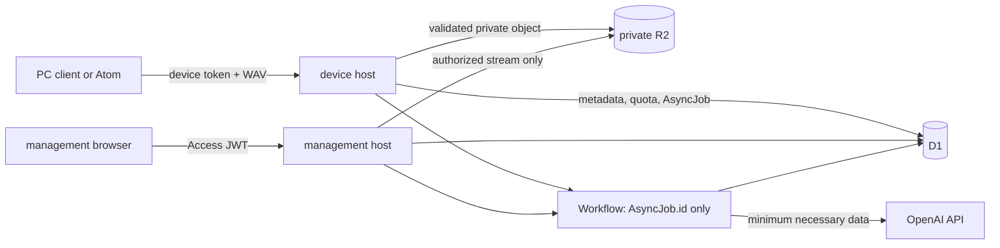

# Phase 1 implementation contracts

`SPEC.md` is the normative source for product behaviour. This document fixes the
storage, route, and test-level representations needed to implement that behaviour.
It must not weaken `SPEC.md`; a conflict is resolved by updating `SPEC.md` first.

## Threat model and data flow

| Asset / boundary | Threat | Required control |
| --- | --- | --- |
| PC / Atom to device API | Token theft, replay, oversized audio | TLS; bearer token is HMAC-verified in constant time and bound to one `household_id` and `source_id`; validate WAV before R2 write; `client_capture_id` idempotency |
| Device API | Device reaches management data | Separate host and route allow-list; device scope is create/upload/process/read-own-status only |
| Management host | Forged or expired Access assertion | Verify Access JWT signature from JWKS, `iss`, application `aud`, and `exp`; derive household server-side |
| Worker to D1/R2/OpenAI | Cross-household read, leaked object key or key material | Authorization predicate in every query; private R2 only through authorized stream; secrets only in Worker bindings; logs never contain content, keys, or tokens |
| Workflow persistence | Audio, transcript, note, or token retained in workflow state | Start and persist only `AsyncJob.id`; read all content transiently from D1/R2 after authorization |
| Concurrent requests / retry | Duplicate charge, duplicate occurrence, stale overwrite | D1 unique constraints, `version` compare-and-swap, one active job per operation, and atomic quota reservation |
| AI / model output | Prompt injection, unsafe output persistence | Treat all customer text as tagged data, use schema-validated allowed values only, and HTML-escape on output |
| Demo operation | Unlimited spend or writes after review | D1 daily/lifetime caps, fixed retry limits, `DEMO_WRITE_ENABLED`, and deadline check before every write/AI reservation |



The route state exposed to clients is the state tables and Mermaid diagram in
`SPEC.md` sections "処理フロー" and "API案". Every endpoint below returns the
current resource state, so an unknown dispatch result can converge through polling
instead of a blind resend.

## D1 relational contract

Timestamps are UTC ISO-8601 strings. IDs are opaque, server-generated strings;
they never contain a name, transcript, email address, or R2 key. SQLite foreign
keys must be enabled for every D1 connection before a transaction.

```sql
CREATE TABLE households (
  id TEXT PRIMARY KEY,
  created_at TEXT NOT NULL
);
CREATE TABLE management_principals (
  access_subject TEXT NOT NULL, household_id TEXT NOT NULL REFERENCES households(id),
  created_at TEXT NOT NULL, revoked_at TEXT, PRIMARY KEY (access_subject, household_id)
);
CREATE TABLE sources (
  id TEXT PRIMARY KEY,
  household_id TEXT NOT NULL REFERENCES households(id),
  source_type TEXT NOT NULL CHECK (source_type IN ('pc','atom','sample')),
  created_at TEXT NOT NULL,
  UNIQUE (household_id, id)
);
CREATE TABLE device_tokens (
  id TEXT PRIMARY KEY,
  household_id TEXT NOT NULL REFERENCES households(id), source_id TEXT NOT NULL,
  token_hmac TEXT NOT NULL UNIQUE,
  expires_at TEXT NOT NULL,
  revoked_at TEXT,
  last_used_at TEXT,
  created_at TEXT NOT NULL,
  CHECK (length(token_hmac) = 64),
  FOREIGN KEY (household_id, source_id) REFERENCES sources(household_id, id)
);
CREATE TABLE recordings (
  id TEXT PRIMARY KEY,
  household_id TEXT NOT NULL REFERENCES households(id),
  source_id TEXT NOT NULL,
  client_capture_id TEXT NOT NULL,
  captured_at TEXT NOT NULL,
  captured_at_original TEXT NOT NULL,
  captured_at_source TEXT NOT NULL CHECK (captured_at_source IN ('client_clock','device_clock','server_received','manual')),
  captured_timezone TEXT NOT NULL,
  received_at TEXT NOT NULL,
  pre_roll_seconds INTEGER NOT NULL CHECK (pre_roll_seconds BETWEEN 0 AND 10),
  post_roll_seconds INTEGER NOT NULL CHECK (post_roll_seconds BETWEEN 0 AND 5),
  post_roll_truncated INTEGER NOT NULL CHECK (post_roll_truncated IN (0,1)),
  duration_seconds REAL NOT NULL CHECK (duration_seconds > 0 AND duration_seconds <= 20),
  audio_object_key TEXT, audio_sha256 TEXT CHECK (audio_sha256 IS NULL OR length(audio_sha256) = 64),
  upload_status TEXT NOT NULL CHECK (upload_status IN ('reserved','ready','failed')),
  analysis_status TEXT NOT NULL CHECK (analysis_status IN ('pending','transcribing','extracting_words','ready','partial','failed')),
  review_status TEXT NOT NULL CHECK (review_status IN ('pending','approved','deleting','delete_failed','deleted')),
  diary_status TEXT NOT NULL CHECK (diary_status IN ('not_started','generating','ready','failed')),
  image_status TEXT NOT NULL CHECK (image_status IN ('not_requested','generating','ready','failed','limit_reached')),
  active_attempt_id TEXT,
  version INTEGER NOT NULL DEFAULT 1 CHECK (version > 0),
  created_at TEXT NOT NULL,
  updated_at TEXT NOT NULL,
  retention_delete_after TEXT,
  deleted_at TEXT,
  UNIQUE (household_id, source_id, client_capture_id), UNIQUE (household_id, id),
  FOREIGN KEY (household_id, source_id) REFERENCES sources(household_id, id)
);
CREATE INDEX recordings_household_visible ON recordings(household_id, review_status, captured_at);
CREATE TABLE transcripts (
  recording_id TEXT PRIMARY KEY REFERENCES recordings(id),
  raw_text TEXT, reviewed_text TEXT, language TEXT, model TEXT, prompt_version TEXT,
  created_at TEXT NOT NULL, updated_at TEXT NOT NULL
);
CREATE TABLE word_candidates (
  id TEXT PRIMARY KEY, recording_id TEXT NOT NULL REFERENCES recordings(id),
  surface TEXT NOT NULL, normalized TEXT NOT NULL, part_of_speech TEXT,
  is_new_candidate INTEGER NOT NULL CHECK (is_new_candidate IN (0,1)),
  UNIQUE (recording_id, normalized)
);
CREATE TABLE dictionary_words (
  id TEXT PRIMARY KEY, household_id TEXT NOT NULL REFERENCES households(id),
  normalized TEXT NOT NULL, display_name TEXT NOT NULL,
  first_recording_id TEXT, first_spoken_at TEXT,
  occurrence_count INTEGER NOT NULL DEFAULT 0 CHECK (occurrence_count >= 0),
  UNIQUE (household_id, normalized), UNIQUE (household_id, id),
  FOREIGN KEY (household_id, first_recording_id) REFERENCES recordings(household_id, id)
);
CREATE TABLE word_occurrences (
  id TEXT PRIMARY KEY, household_id TEXT NOT NULL REFERENCES households(id),
  recording_id TEXT NOT NULL REFERENCES recordings(id),
  dictionary_word_id TEXT NOT NULL REFERENCES dictionary_words(id),
  surface TEXT NOT NULL, spoken_at TEXT NOT NULL,
  new_override TEXT NOT NULL CHECK (new_override IN ('auto','force_new','force_not_new')),
  is_first INTEGER NOT NULL CHECK (is_first IN (0,1)),
  created_at TEXT NOT NULL, updated_at TEXT NOT NULL,
  UNIQUE (recording_id, dictionary_word_id),
  FOREIGN KEY (household_id, recording_id) REFERENCES recordings(household_id, id),
  FOREIGN KEY (household_id, dictionary_word_id) REFERENCES dictionary_words(household_id, id)
);
CREATE TABLE diary_entries (
  id TEXT PRIMARY KEY, recording_id TEXT NOT NULL UNIQUE REFERENCES recordings(id),
  scene TEXT, parent_note TEXT, diary_text TEXT, model TEXT, prompt_version TEXT,
  version INTEGER NOT NULL DEFAULT 1 CHECK (version > 0), created_at TEXT NOT NULL, updated_at TEXT NOT NULL
);
CREATE TABLE diary_images (
  id TEXT PRIMARY KEY, diary_entry_id TEXT NOT NULL REFERENCES diary_entries(id),
  image_object_key TEXT NOT NULL, generation_number INTEGER NOT NULL CHECK (generation_number BETWEEN 1 AND 5),
  is_active INTEGER NOT NULL CHECK (is_active IN (0,1)), model TEXT, prompt_version TEXT,
  created_at TEXT NOT NULL, deleted_at TEXT,
  UNIQUE (diary_entry_id, generation_number)
);
CREATE UNIQUE INDEX one_active_image ON diary_images(diary_entry_id) WHERE is_active = 1 AND deleted_at IS NULL;
CREATE TABLE async_jobs (
  id TEXT PRIMARY KEY, household_id TEXT NOT NULL REFERENCES households(id),
  recording_id TEXT NOT NULL,
  job_type TEXT NOT NULL CHECK (job_type IN ('analysis','diary','image','delete')),
  status TEXT NOT NULL CHECK (status IN ('dispatch_pending','dispatched','running','succeeded','failed')),
  workflow_instance_id TEXT, operation_number INTEGER NOT NULL CHECK (operation_number > 0),
  correlation_id TEXT NOT NULL, last_error_code TEXT, created_at TEXT NOT NULL,
  updated_at TEXT NOT NULL, started_at TEXT, finished_at TEXT,
  UNIQUE (recording_id, job_type, operation_number), UNIQUE (household_id, id),
  FOREIGN KEY (household_id, recording_id) REFERENCES recordings(household_id, id)
);
CREATE TABLE processing_attempts (
  id TEXT PRIMARY KEY, household_id TEXT NOT NULL REFERENCES households(id), recording_id TEXT NOT NULL,
  job_id TEXT NOT NULL,
  processing_kind TEXT NOT NULL CHECK (processing_kind IN ('analysis','diary','image','delete')),
  stage TEXT NOT NULL, attempt_number INTEGER NOT NULL CHECK ((processing_kind = 'image' AND attempt_number BETWEEN 1 AND 5) OR (processing_kind <> 'image' AND attempt_number BETWEEN 1 AND 3)),
  status TEXT NOT NULL CHECK (status IN ('running','succeeded','failed','unknown')),
  provider_request_id TEXT, error_code TEXT, retryable INTEGER NOT NULL CHECK (retryable IN (0,1)),
  correlation_id TEXT NOT NULL, started_at TEXT NOT NULL, finished_at TEXT,
  UNIQUE (job_id, attempt_number), UNIQUE (recording_id, processing_kind, attempt_number),
  FOREIGN KEY (household_id, recording_id) REFERENCES recordings(household_id, id),
  FOREIGN KEY (household_id, job_id) REFERENCES async_jobs(household_id, id)
);
CREATE UNIQUE INDEX one_nonterminal_job ON async_jobs(recording_id, job_type)
  WHERE status IN ('dispatch_pending','dispatched','running');
CREATE TABLE usage_counters (
  counter_key TEXT NOT NULL, household_id TEXT REFERENCES households(id), scope TEXT NOT NULL,
  usage_day TEXT NOT NULL, used_count INTEGER NOT NULL DEFAULT 0 CHECK (used_count >= 0),
  reserved_count INTEGER NOT NULL DEFAULT 0 CHECK (reserved_count >= 0),
  updated_at TEXT NOT NULL, PRIMARY KEY (counter_key, usage_day),
  CHECK ((scope = 'image_lifetime' AND usage_day = 'lifetime') OR (scope <> 'image_lifetime' AND usage_day GLOB '????-??-??'))
);
CREATE TABLE audit_events (
  id TEXT PRIMARY KEY, household_id TEXT NOT NULL REFERENCES households(id),
  recording_id TEXT, event_type TEXT NOT NULL,
  actor_type TEXT NOT NULL CHECK (actor_type IN ('management_user','device','system')),
  actor_id TEXT NOT NULL, before_captured_at TEXT, after_captured_at TEXT,
  correlation_id TEXT NOT NULL, created_at TEXT NOT NULL,
  FOREIGN KEY (household_id, recording_id) REFERENCES recordings(household_id, id)
);
CREATE TABLE recording_tombstones (
  recording_id TEXT PRIMARY KEY, household_id TEXT NOT NULL REFERENCES households(id),
  review_status TEXT NOT NULL CHECK (review_status = 'deleted'), deleted_at TEXT NOT NULL
);
```

`counter_key` is `demo-global:{scope}` for the environment-wide quota,
`household:{household_id}:{scope}` for a household quota, or
`recording:{recording_id}:image` for the five-image lifetime quota. Reservation
increments are conditional on their applicable cap in the same transaction.
The D1 migration also creates the needed status/expiry indexes. It must not add a
content-bearing `details` column to attempts, jobs, audit events, or logs.

## Atomic transaction boundaries

| Operation | One D1 transaction must include |
| --- | --- |
| Upload create/deduplicate | reserve the unique capture key and deterministic opaque R2 key in D1 first; write only matching SHA-256 bytes; atomically mark `upload_status = ready`, or mark failed and enqueue bounded orphan cleanup |
| Process/diary/image dispatch | optimistic version / active-job check; expiry and `DEMO_WRITE_ENABLED`; quota and attempt reservation; job create-or-return-existing; resource state update |
| Before each OpenAI call | recheck expiry/kill switch and active attempt; create/update exactly one `ProcessingAttempt`; reserve counted usage; never call OpenAI if the transaction fails |
| Review save/approve | `UPDATE ... WHERE id=? AND household_id=? AND version=?`; transcript/occurrences/dictionary aggregate recomputation/audit event/version increment together |
| Image replacement | version check; quota/job reservation; only after R2 success atomically activate the new image and deactivate the former image |
| Delete | immediately hide/invalidate active attempts; later delete workflow deletes all content-bearing child rows and the `Recording`, then inserts only `recording_tombstones(recording_id, household_id, review_status, deleted_at)` |

`DictionaryWord` first fields and every `WordOccurrence.is_first` are recomputed in
the approval/date-edit transaction by `(spoken_at, recordings.created_at, recording_id)`.
No client-supplied `is_first`, quota, status, household, or R2 key is trusted.

## Object storage and retention

Private R2 keys use opaque IDs only:

```text
recordings/{recording_id}/audio.wav
diary-images/{diary_entry_id}/{diary_image_id}.png
```

R2 has no public binding, public bucket URL, or client-issued signed URL. A Worker
authorizes each stream and does not disclose these keys. A successful new image is
stored before it becomes active. Deleted/old objects are queued through a bounded
delete job; an inaccessible object is never re-enabled.

Each live record has a server-set `retention_delete_after = created_at + 30 days`.
A scheduled Worker finds due records through an indexed timestamp, starts the same
bounded delete job, and retries deletion failures at most three times. It must not
leave a due record merely "eligible" for a manual operation. Client spools retain at most 20 clips / 25 MiB / 7 days, deleting WAV
after the R2 recording ID is confirmed and retaining only minimal process metadata
until `202 Accepted` is confirmed. Operational logs retain only state, duration,
correlation ID, and error code for 7 days.

## Host, authorization, and job contract

| Host | Allowed route family | Required identity |
| --- | --- | --- |
| management host | review, diary, dictionary, authorized audio/image, management record APIs | Verified Access JWT; household derived server-side |
| device host | upload, own-record process, own-record status | Valid non-expired device token bound to the source |

All unmatched host/method/path/Content-Type combinations fail before application
logic. Both hosts deny CORS by default. The management host rejects a device token;
the device host rejects a management JWT for device operations. The API always
uses the same not-found/unauthorized response shape for out-of-scope IDs.

For every accepted asynchronous operation, create a stable opaque `AsyncJob.id`.
The Workflow instance ID is that job ID (or a deterministic non-sensitive derived
value), the input is `{ "async_job_id": "job_xxx" }`, and its persistent state is
limited to opaque IDs and status. `dispatch_pending` is recoverable by attempting
"create or confirm existing" with the same ID. Workers/D1, not workflow history,
are authoritative. Each `step.do()` explicitly sets the finite retry limit in
`SPEC.md`; SDK retries are disabled (`maxRetries: 0`). A post-send timeout becomes
`UPSTREAM_RESULT_UNKNOWN`, consumes its reservation, and requires polling before a
manual retry.

The Worker maps the verified Access JWT `sub` to an allow-listed server-side
`management_principals(sub, household_id)` row; email is a display/Access-policy
attribute, never the authorization key. A device `GET /recordings/{id}` response is
limited to `recording_id`, `analysis_status`, `review_status`, `version`, safe
error fields, and the caller's own `AsyncJob` summary. It excludes transcript,
word candidates, diary data, R2 fields, attempts, and all management metadata.

| Route family | State precondition | Success effect |
| --- | --- | --- |
| `POST /recordings` | valid owned source and valid WAV | `Recording.analysis_status = pending`, review `pending` |
| `POST /recordings/{id}/process` | owner; not deleting/deleted; analysis retry budget | create/return analysis job and return `202`; worker advances `pending → transcribing → extracting_words → ready/partial/failed` |
| `PATCH /recordings/{id}/review` | management identity; matching recording version | draft data and optional timestamp audit saved; version increments |
| `POST /recordings/{id}/approve` | management identity; matching version; analysis `ready`, `partial`, or `failed` | atomic approval and `WordOccurrence` update; create/return diary job and return `202` |
| `POST /diary/{id}/regenerate` | management identity; matching diary version and retry budget | create/return diary job; `diary_status = generating` |
| `POST /diary/{id}/image` | management identity; matching diary version; explicit replacement confirmation if needed | create/return image job; `image_status = generating` without deleting active image |
| `DELETE /recordings/{id}` | management identity; matching version | hide immediately, invalidate attempts, create/return delete job and return `202` |

## OpenAI data boundary

Only the analysis Workflow sends the subject WAV to `/v1/audio/transcriptions`;
the word-extraction Workflow sends the resulting transcript as tagged data; the
diary Workflow sends approved transcript, scene, and parent note as tagged data;
the image Workflow sends only the approved diary text and fixed style instruction.
No other household history, token, R2 key, internal error, or audit detail is sent.
Responses requests set `store: false`, OpenAI background mode is never used, and
the OpenAI SDK has `maxRetries: 0`. The Phase 7 public artifacts must disclose the
sent data, no-training default, possible abuse-monitoring retention, the limited
meaning of `store: false`, and the ban on real children's data, as required by
`SPEC.md`.

## HTTP contract and error shape

The machine-readable source is [openapi.json](../packages/shared/api/openapi.json).
It defines every Phase 1 route, identity scheme, request body, common error, and
state enum. Human-readable rules in this document and `SPEC.md` remain required
where OpenAPI cannot express authorization predicates or transaction boundaries.

All JSON API success responses include `correlation_id`. Mutations require JSON
`Content-Type`, bounded bodies, and `version` when modifying an existing resource;
the multipart WAV upload is the explicit exception, with its non-file fields
validated by the shared OpenAPI contract.
Times are RFC 3339 UTC values in 2000--2099; `captured_timezone` is an IANA zone.

```json
{
  "code": "VERSION_CONFLICT",
  "message": "This item changed. Reload it and try again.",
  "retryable": false,
  "correlation_id": "corr_xxx",
  "next_action": "reload"
}
```

The error `message` never contains user input, a token, SQL, a stack trace, an R2
key, or a provider response. Required codes include `UNAUTHORIZED`, `FORBIDDEN`,
`NOT_FOUND`, `VALIDATION_ERROR`, `VERSION_CONFLICT`, `COST_LIMIT_REACHED`,
`DEMO_WRITE_DISABLED`, `UPSTREAM_RESULT_UNKNOWN`, and
`IMAGE_REPLACEMENT_CONFIRMATION_REQUIRED`.

```json
// POST /api/v1/recordings (device host): multipart fields plus WAV
{
  "client_capture_id": "019f0000-0000-7000-8000-000000000000",
  "captured_at": "2026-07-20T01:00:00Z",
  "captured_timezone": "Asia/Tokyo",
  "pre_roll_seconds": 10,
  "post_roll_seconds": 5,
  "post_roll_truncated": false
}
// 201/200 deduplicated response
{ "recording_id": "rec_xxx", "analysis_status": "pending", "review_status": "pending", "version": 1, "deduplicated": false, "correlation_id": "corr_xxx" }
```

```json
// POST /api/v1/recordings/rec_xxx/process, POST /approve, diary/image generation
// 202 response
{ "async_job_id": "job_xxx", "status": "dispatched", "correlation_id": "corr_xxx" }
```

`POST /approve` accepts the fields and empty-text/empty-word semantics in `SPEC.md`.
`POST /diary/{id}/image` requires `{ "version": 5, "replace_image_id": "image_xxx" }`
when an active image exists. A missing replacement confirmation returns the named
409 error without consuming a quota or creating a job.

## Contract-test matrix

Before endpoint code is added, convert these rows into deterministic contract tests
against the shared JSON Schema/OpenAPI source. Mock OpenAI; no test calls real APIs.

| Case | Expected invariant |
| --- | --- |
| Same `client_capture_id` replay | Same recording ID, no second R2 write or quota/job consumption |
| Wrong host/token/JWT/household | Identical denial shape; no data, object key, or existence leak |
| Invalid WAV, oversized body, invalid time/enum | `VALIDATION_ERROR`, no R2 object or D1 row |
| Same capture ID with different SHA-256 | `IDEMPOTENCY_CONFLICT`; no second object/record/job |
| Stale review/image version | `409 VERSION_CONFLICT`, no overwrite or quota/job reservation |
| Concurrent process/image request | One job and one quota reservation only |
| Expiry or kill switch before/resumed Workflow call | No OpenAI call; terminal recoverable state and safe error |
| 429/5xx vs permanent/provider-unknown error | Only explicit finite retry; unknown result never automatically resent |
| Late result after delete/new attempt | No restored/deleted data and no stale overwrite |
| Image replacement failure | Existing active image remains active |
| Approval/date edit | Unique occurrence; deterministic first word and dictionary aggregates recomputed |
| Workflow payload/state inspection | Contains only opaque job/attempt identifiers and status |
| Error serialization/log capture | No secret, transcript, note, audio, R2 key, SQL, or stack trace |
| Access and device authentication | Reject invalid signature, `iss`, `aud`, `exp`, unknown `sub`, expired/revoked token, and cross-source token |
| Browser and host protections | Reject cross-origin CORS, missing/invalid CSRF on cookie mutations, and identity/route mismatch |
| Global cap and lifecycle | Concurrent households cannot exceed demo-global cap; total operation attempts stop at three; due 30-day records start bounded deletion |

## Phase 1 implementation gate

The next Phase 1 increment is executable schema/API-contract testing. It requires
one approved Python source/test layout because the repository currently has
`main/src/` while the quality configuration targets `src/`. This document adds no
runtime dependency and does not alter that configuration.
